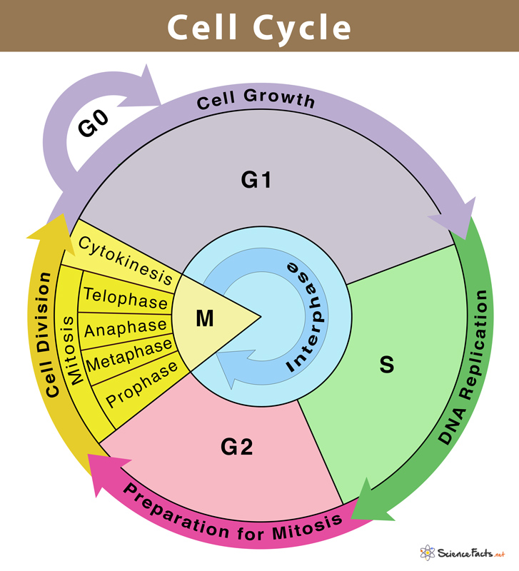
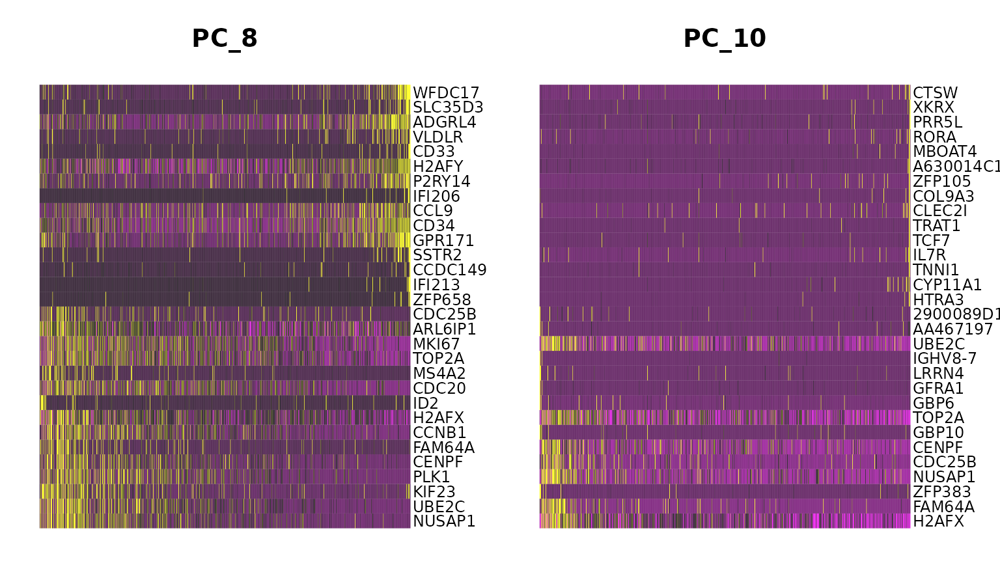
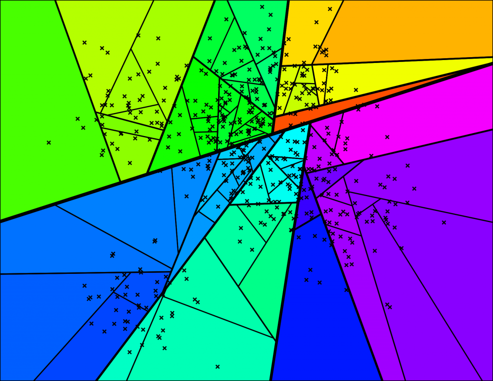
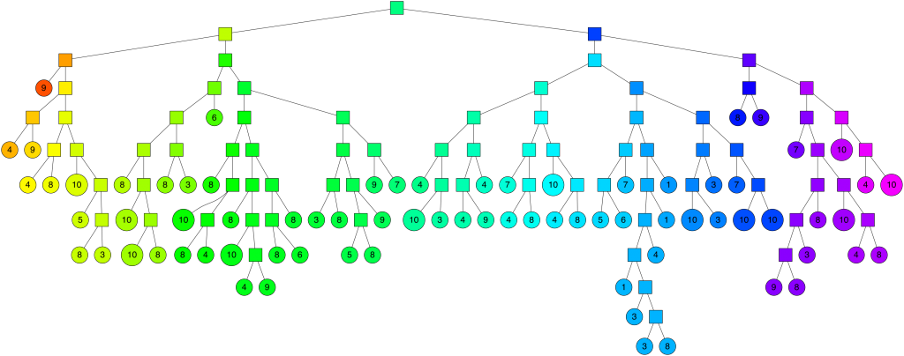
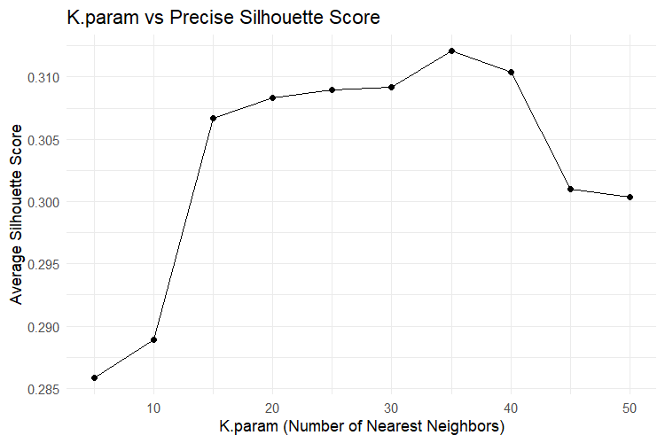
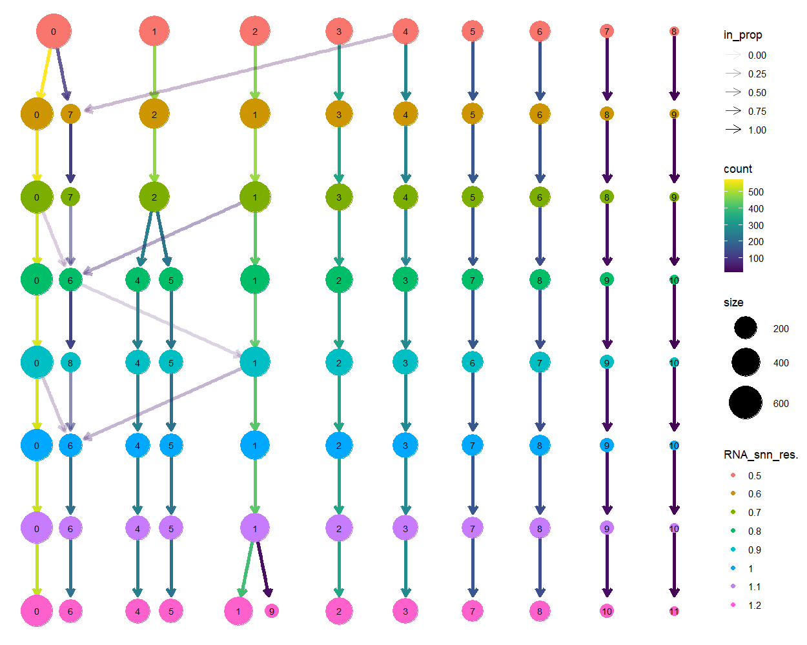

#  Preface

This tutorial is about Seurat v5, and the main reference is: 🔗[started_v5](https://satijalab.org/seurat/articles/get_started_v5_new)

<br>

***

# Additional knowledge

##  Cross species homologous gene conversion

In single-cell sequencing analysis, we will encounter many <font color="#00b050">cross-species homologous gene conversion</font> problems 

Below, an example of a gene for the cell cycle and how it can be converted from the human version of the gene to a version from another species

**Reference**: 🔗[跨物种同源基因转换](https://www.jianshu.com/p/abf5138e3757) 

- Loading cell cycle genes (human)

  ```r
  library(Seurat)
  
  s.genes <- cc.genes$s.genes
  g2m.genes <- cc.genes$g2m.genes
  ```

<br>

- We can use `biomaRt` package to convert this genes 

  ```R
  library(biomaRt)
  
  # set mart object
  human <- useMart("ensembl", dataset = "hsapiens_gene_ensembl")
  mouse <- useMart("ensembl", dataset = "mmusculus_gene_ensembl")
  
  
  # turn to s.genes of the mouse and rat
  s.genes.mouse <- getLDS(attributes = c("hgnc_symbol"), 
                          filters = "hgnc_symbol", 
                          values = cc.genes$s.genes, 
                          mart = human, 
                          attributesL = c("mgi_symbol"), 
                          martL = mouse, 
                          uniqueRows = TRUE)[, 2]
  
  
  # turn to g2m.genes of the mouse and rat
  g2m.genes.mouse <- getLDS(attributes = c("hgnc_symbol"), 
                            filters = "hgnc_symbol", 
                            values = cc.genes$g2m.genes, 
                            mart = human, 
                            attributesL = c("mgi_symbol"), 
                            martL = mouse, 
                            uniqueRows = TRUE)[, 2]
  ```

<br>

- If you do not connect the `biomaRt`, you can use `homologene`package to convert this genes   

  But `homologene` was<font color="#ff0000"> last updated on 2014-04-09 </font>with only 21 species, so it's probably still `biomaRt` that's a bit more complete

  ```r
  library(homologene)
  
  # check the tax_ID
  homologene::taxData
  
  # mouse
  homologene(s.genes, inTax = 9606, outTax = 10090)
  homologene(g2m.genes, inTax = 9606, outTax = 10090)
  
  s.genes.mouse <- homologene(s.genes, inTax = 9606, outTax = 10090)[,2]
  g2m.genes.mouse <- homologene(g2m.genes, inTax = 9606, outTax = 10090)[,2]
  ```

<br>  

  
- `homologeneData2` also includes an updated version of the `homologene` database that replaces gene symbols and identifiers with the their latest version🔗 [Updating the good old Homologene database - B. Ogan Mancarci](https://oganm.com/homologene-update/)

  ```R
  library(homologene)
  
  # loading homologeneData2
  data("homologeneData2")
  
  s.genes.mouse <- homologene(s.genes, inTax = 9606, outTax = 10090, db = homologeneData2)[,2]
  g2m.genes.mouse <- homologene(g2m.genes, inTax = 9606, outTax = 10090, db = homologeneData2)[,2]
  ```
  
  The `homologeneData2` object that comes with the GitHub version of this package is **updated weekly** 
  
  but if you are using the CRAN version and want the latest annotations, or if you want to keep a frozen version `homologene`, you can use the `updateHomologene` function.
  
  ```R
  # update the homologene database with the latest identifiers
  homologeneDataVeryNew = updateHomologene() 
  
  s.genes.mouse <- homologene(s.genes, inTax = 9606, outTax = 10090, db = homologeneDataVeryNew)[,2]
  g2m.genes.mouse <- homologene(g2m.genes, inTax = 9606, outTax = 10090, db = homologeneDataVeryNew)[,2]
  ```

<br>

- you can easily convert this genes : first letter uppercase, rest lowercase. (**not recommend**)

  ```R
  s.genes.mouse <- stringr::str_to_title(tolower(s.genes))
  g2m.genes.mouse <- stringr::str_to_title(tolower(C.genes))
  ```

<br>

* Use the website to perform cross-species homologous gene conversion  
  🔗 [Ensembl BioMart](https://www.ensembl.org/biomart/martview)  
  * After opening the URL, select:  
    * 📚 **Database**: Ensembl Genes  
    * 🧫 **Dataset**: select **Human genes (GRCh38)** (or your current species) <br><br> 
  * 🧩 Click on **Filters** on the left:  
    Open **GENE** → enter your gene list (human symbol e.g. `MCM5` etc.) in the “Input external references ID list”.  <br><br>
  - 🎛️ Click on **Attributes** on the left:  
    The human gene symbol will be included by default, scroll down to **Homologs** and check the box:  
    - 🐭 Mouse homologs → Symbol  
    - 🐀 Rat homologs → Symbol  <br><br>

  - 📥 Click on top **Results** → View and download results (can export to TSV or Excel)  

<br>

***

## Calculate module scores for feature expression 

### preface

* We can use `AddModuleScore()` function calculate **supervised module scores** for any list of genes
    **such as** cytokine score, inflammatory score and cell cycle score<br><br>
*  The scoring strategy described in 🔗[Tirosh et al. 2016](http://science.sciencemag.org/content/352/6282/189)

<br>

### Where we can find gene list are interested in ? 

you can find gene list in 🔗[MSigDB](https://www.gsea-msigdb.org/gsea/msigdb/)

<br>

### What does AddModuleScore do ？

1.🔍**Process the input features** (the gene-list you are interested in)
Check if the gene you entered exists in the `Seurat object`
⚠️ if it is not found it will give a warning and try to use `UpdateSymbolList` to find the synonym.<br><br>
2. 🧪**Construction of a pool of background genes** **(control genes)**
All genes are divided into `nbin` intervals (bins) according to their expression levels, this is to find the background genes (control genes) that have similar expression levels to the target genes.<br><br>
3. 🎯**Match control genes by bin**
For each target gene you provide, randomly select `ctrl` background genes in the same expression bin.<br><br>
4. 🧮**Calculate score**
   $$
   Module Scorecell=\overline{Expr}_{features}−\overline{Expr}_{controls}
   $$

   - $\overline{Expr}_{features}$: Average expression of your genes of interest (e.g., cell cycle genes) for each cell.
   - $\overline{Expr}_{controls}$: Average expression of **control genes** for each cell.<br><br>
### AddModuleScore arguments

| arguments  | explanation                                                                                                                                                                                                                |
| ---------- | -------------------------------------------------------------------------------------------------------------------------------------------------------------------------------------------------------------------------- |
| `object`   | `Seurat object`                                                                                                                                                                                                            |
| `features` | A `list` of `vectors` of features ; each entry should be a `vector` of feature names                                                                                                                                       |
| `pool`     | List of features to check expression levels against, Defaults is all genes (`rownames`)                                                                                                                                    |
| `nbin`     | Number of bins of aggregate expression levels for all analyzed features (Default: `24`)                                                                                                                                    |
| `ctrl`     | Number of control features selected from the same bin per analyzed feature (Default: `100`)                                                                                                                                |
| `k`        | Use feature clusters returned from `DoKMeans`                                                                                                                                                                              |
| `assay`    | Name of assay to use                                                                                                                                                                                                       |
| `name`     | Name for the expression programs; will append a number to the end for each entry in features (eg. if features has three programs, the results will be stored as `name1`, `name2`, `name3`, respectively)                   |
| `seed`     | 🌱Set a random seed. If `NULL`, seed is not set.                                                                                                                                                                           |
| `search`   | 🔍Search for symbol synonyms for features in features that don't match features in object                                                 Searches the HGNC's gene names database; see `UpdateSymbolList` for more details |
| `slot`     | Slot to calculate score values off of. Defaults to `data` slot (i.e. log-normalized counts)                                                            You can also choose `counts` or `scale.data`                        |
<br>

### AddModuleScore Code

**cell cycle genes as an example**, which stores S and G2/M scores in object `metadata`

```R
library(Seurat)

# cell cycle genes
s.genes <- cc.genes$s.genes
g2m.genes <- cc.genes$g2m.genes

# transform to list
gene <- as.list(s.genes,g2m.genes)

# caluclate score
scRNA <- AddModuleScore(
    object = scRNA,
    features = gene,
    ctrl = 100, 
    name = c("s",'g2')
)
```

<br>

***

# Installing Package

* Installing Seurat v5

  ```R
  install.packages('Seurat')
  ```

<br>

* Seurat does not require, but makes use of, packages developed by other labs that can substantially **enhance speed and performance**

  ```R
  setRepositories(ind = 1:3, addURLs = c('https://satijalab.r-universe.dev', 'https://bnprks.r-universe.dev/'))
  install.packages(c("BPCells", "presto", "glmGamPoi"))
  ```

  * `BPCells` A package designed for **fast, memory-efficient** single-cell RNA-seq analysis
  * `presto` **Speeds up differential expression testing** on large-scale single-cell datasets.
  * `glmGamPoi`A package for **fitting generalized linear models** using a Negative Binomial distribution.

<br>

- We also recommend installing these additional packages, which are used in our vignettes, and enhance the functionality of Seurat

  ```R
  if (!requireNamespace("remotes", quietly = TRUE)) {
    install.packages("remotes")
  }
  install.packages('Signac')
  remotes::install_github("satijalab/seurat-data", quiet = TRUE)
  remotes::install_github("satijalab/azimuth", quiet = TRUE)
  remotes::install_github("satijalab/seurat-wrappers", quiet = TRUE)
  ```

  * `remotes` allows you to install R packages directly from GitHub
  - [Signac](https://github.com/stuart-lab/signac): analysis of single-cell chromatin data (e.g. ATAC-seq)
  - [SeuratData](https://github.com/satijalab/seurat-data): This package is used to **manage reference datasets** used in Seurat tutorials or demonstrations
  - [Azimuth](https://github.com/satijalab/azimuth): local **annotation** of scRNA-seq and scATAC-seq queries across multiple organs and tissues
  - [SeuratWrappers](https://github.com/satijalab/seurat-wrappers) is a collection of community-provided methods and extensions for Seurat,These methods comprise functionality not presently found in Seurat, and are able to be updated much more frequently.

<br>

***

# Setup the Seurat Object

## Setup the Seurat Object

- We will be analyzing the a dataset of Peripheral Blood Mononuclear Cells (PBMC) . There are 2,700 single cells that were sequenced on the Illumina NextSeq 500<br><br>
- The [Read10X](https://satijalab.org/seurat/reference/read10x) function reads in the output of the [cellranger](https://support.10xgenomics.com/single-cell-gene-expression/software/pipelines/latest/what-is-cell-ranger) **pipeline** from 10X, returning a unique molecular identified (UMI) **count matrix**.

  

  
<br>

  > [!TIP]
  >
  > **What does data in a count matrix（sparse-matrix） look like?**
  >
  > ```
  > CD3D  4 . 10 . . 1 2 3 1 . . 2 7 1 . . 1 3 . 2  3 . . . . . 3 4 1 5
  > TCL1A . .  . . . . . . 1 . . . . . . . . . . .  . 1 . . . . . . . .
  > MS4A1 . 6  . . . . . . 1 1 1 . . . . . . . . . 36 1 2 . . 2 . . . .
  > ```
  >
  > * The values in this matrix represent the number of molecules for each feature (i.e. gene; row) that are detected in each cell (column).
  >
  > * The `.` values in the matrix represent 0s (no molecules detected). Since most values in an scRNA-seq matrix are 0, Seurat uses a **sparse-matrix** representation whenever possible. This results in significant memory and speed savings 

<br>

- After running `cellranger Pipeline`, you’ll get a folder like this:

  ```text
  <sample_id>/
  ├── outs/
  │   ├── analysis/
  │   │   ├── clustering/
  │   │   ├── diffexp/
  │   │   ├── pca/
  │   │   ├── tsne/
  │   ├── filtered_feature_bc_matrix/       # ✅ Most commonly used count matrix (high-confidence cells)
  │   │   ├── barcodes.tsv.gz
  │   │   ├── features.tsv.gz
  │   │   └── matrix.mtx.gz
  │   ├── raw_feature_bc_matrix/            # Raw counts (before filtering)
  │   │   ├── barcodes.tsv.gz
  │   │   ├── features.tsv.gz
  │   │   └── matrix.mtx.gz
  │   ├── metrics_summary.csv               # Summary stats (e.g., reads per cell, mapping rate)
  │   ├── possorted_genome_bam.bam          # BAM file (aligned reads)
  │   ├── possorted_genome_bam.bam.bai      # BAM index
  │   ├── molecule_info.h5                  # Raw molecule data for further processing
  │   ├── web_summary.html                  # Interactive HTML report
  │   ├── cloupe.cloupe                     # For visualization in Loupe Browser
  └── _cmdline                          # Details of the command used to generate this output
  
  ```

<br>

- we often us **filtered_feature_bc_matrix** as input of `Read10X()`

  ```R
  library(dplyr)
  library(Seurat)
  library(patchwork)  # allows you to compose multiple ggplot2 plots
  
  # Load the PBMC dataset
  scRNA.data <- Read10X(data.dir = "./demo_data_1/filtered_gene_bc_matrices/hg19/")
  ```

<br>

- [CreateSeuratObject](https://satijalab.github.io/seurat-object/reference/CreateSeuratObject.html) will create the Seurat object

  ```R
  # Initialize the Seurat object with the raw (non-normalized data).
  scRNA <- CreateSeuratObject(counts = scRNA.data, 
                             project = "pbmc3k",  
                             min.cells = 3,               # Include features where at least this many cells are detected 
                             min.features = 200)          # Include cells where at least this many features are detected
  scRNA
  ```


## Seurat Object structure

A Seurat object has multiple **slots**, each holding a specific type of data. Here's a breakdown of the most commonly used ones:

```pgsql
Seurat Object
├── assays
│   ├── RNA
│   │   ├── counts         ← raw UMI counts
│   │   ├── data           ← normalized data
│   │   └── scale.data     ← scaled data
│   │
│   └── SCT
│       ├── SCTModel.list        ← Stores the fitting results of the SCTransform model 
│       │    ├──feature.attributes    ← Model fit info per gene (e.g., residual variance, theta)
│       │    ├──cell.attributes       ← Cell attribute table stored during SCTransform modeling(e.g., umi, log_umi)
│       │    ├──clips                 ← Parameters used for clipping residuals
│       │    ├──umi.assay
│       │    ├──model                 ← use model
│       │    ├── arguments            ← Stores the parameters used SCTransform()
│       │    └── median_umi
│       │
│       ├── counts               ← corrected UMI counts
│       ├── data                 ← log-normalized versions of these corrected UMI counts
│       ├── scale.data           ← Scaled residuals (usually only for variable genes)
│       ├── assay.orig
│       ├──var.features          ← variable genes 
│       ├──meta.features         ← metadata of all genes
│       ├──misc                  ← miscellaneous data 
│       └──key                   ← Prefix information in SCTransform
│
│
├── meta.data            ← cell-level metadata (e.g., sample, cluster ID, nUMI, etc.)
│
├── reductions
│   ├── pca
│   └── umap / tsne      ← stores reduced dimensions
│
├── active.assay         ← tells Seurat which assay is "active" 
│
├── graphs               ← stores neighbor graphs for clustering (e.g., SNN)
│
├── neighbors            ← nearest neighbor graph results
│
├── commands             ← keeps track of Seurat processing steps
│
├── misc                 ← for storing any custom data
│
└── misc data slots
    ├── ident            ← identity class (often clusters)
    └── project.name     ← name of the Seurat project

```


<br>

***

# QC and selecting cells for further analysis

## Calculate mitochondrial QC metrics

Use [PercentageFeatureSet()](https://satijalab.org/seurat/reference/percentagefeatureset) function to calculates the percentage of counts originating from a set of features

- Low-quality / dying cells often exhibit extensive mitochondrial contamination
- We use the set of all genes starting with `MT-`(for human) and `Mt-` or `mt-` (for mouse and Rat) as a set of mitochondrial genes

```R
# The [[]] operator can add columns to object metadata.
scRNA[["percent.mt"]] <- PercentageFeatureSet(scRNA, pattern = "^MT-")
```

<br>

##  Calculate erythrocyte QC metrics(optional) 

you can calculate erythrocyte QC metrics and determine whether to remove it based on the actual situation

<br>

**Should red blood cells be filtered ?**🤔🤔

* If my research is focus on erythrocyte, of course it cannot be filtered. 

- my research is not focus on erythrocyte ,What impact will erythrocyte have once filtered out???

  - The changes in **highly variable genes**, if not filtered out, contain erythrocyte genes, and if filtered out, there will be no such genes.

  - The **changes in PCA components** .The rotation of the axis is definitely affected by genetic changes, removing some high variable genes and filling in some sub high variable genes, which will increase noise and affect dimensionality reduction, clustering, and clustering.
- The selection of threshold is currently rare in literature that explicitly removes erythrocyte, so it requires considerable caution.
- ❗<font color="#ff0000">**My suggestion is that under normal circumstances, there is no need to filter red blood cells.**</font>

<br>

**What if it's erythrocyte contamination ?** 🤔🤔

Many times, we need to confirm whether split erythrocyte treatment has been performed **before experimental preparation** to reduce the impact of erythrocyte contamination, so we need to analyze it specifically based on our own situation.


😀😀 **you can conversion of cell cycle genes to corresponding version**  Detail: 🪨[[#Cross species homologous gene conversion]] 🔗[Cross species homologous gene conversion](#Cross-species-homologous-gene-conversion)

```R
# calculate erythrocyte QC metrics
## HB.genes(human)
HB.genes <- c("HBA1", "HBA2", "HBB", "HBD", "HBE1", "HBG1", "HBG2", "HBM", "HBQ1", "HBZ")


## Match the expression matrix and select the HB.genes
HB_m <- match(HB.genes, rownames(scRNA@assays$RNA)) 
HB.genes <- rownames(scRNA@assays$RNA)[HB_m] 
HB.genes <- HB.genes[!is.na(HB.genes)] 


## calculate erythrocyte QC metrics
scRNA[["percent.HB"]]<-PercentageFeatureSet(scRNA, features=HB.genes) 
```

<br>

## Visualize QC metrics

### Violin Plot

```R
# Visualize QC metrics as a violin plot
VlnPlot(scRNA, features = c("nFeature_RNA", "nCount_RNA", "percent.mt","percent.HB"), ncol = 4)
```


- The number of unique genes detected in each cell.
  - Low-quality cells or empty droplets will often have very few genes
  - Cell doublets or multiplets may exhibit an aberrantly high gene count

<br>

###   Frequency distribution histogram

```R
# Load required libraries
library(reshape2)  # For reshaping data (wide to long format)
library(ggplot2)   # For plotting


# per setting
features <- c("nFeature_RNA", "nCount_RNA", "percent.mt", "percent.HB")


# extract metadata
meta <- scRNA@meta.data


# Select the QC metrics from the Seurat object's metadata
qc_pct <- meta[, features]


# Reshape the data into long format for ggplot (makes faceted plots easier)
qc_pct_long <- melt(qc_pct)


# Plot histograms
ggplot(qc_pct_long, aes(x = value)) +
  geom_histogram(binwidth = 1, fill = "salmon", color = "black") +  # Create histogram with bin width = 1
  facet_wrap(~variable, scales = "free", ncol = 2) +     # Create a separate panel for each variable
                                                        # Only one feature can be commented out, Otherwise, wil error 
  theme_minimal() +                                                
  labs(
    x = "Value",                      
    y = "Number of cells",            
    title = "Distribution of QC Metrics" 
  )
```


<br>

**We can restrict the x-axis to find best threshold ** 

```R
library(ggplot2)
library(reshape2)
library(patchwork)  # Package for Puzzles


# per setting
features <-c("nFeature_RNA")
x_range1 <- c(0, 500)
x_range2 <- c(1500, 3500)


# extract metadata
meta <- scRNA@meta.data


# Select the QC metrics from the Seurat object's metadata
qc_pct <- meta[, features]


# Reshape the data into long format for ggplot (makes faceted plots easier)
qc_pct_long <- melt(qc_pct)


# Plot histograms
p1 <- ggplot(qc_pct_long, aes(x = value)) +
  geom_histogram(binwidth = 50, fill = "salmon", color = "salmon") +
  coord_cartesian(xlim = x_range1) +
  theme_minimal() +
  labs(x = "Number of genes", y = "Number of cells", title = "QC Metric: nFeature_RNA")


p2 <- ggplot(qc_pct_long, aes(x = value)) +
  geom_histogram(binwidth = 50, fill = "salmon", color = "salmon") +
  coord_cartesian(xlim = x_range2) +
  theme_minimal() +
  labs(x = "Number of genes", y = NULL, title = NULL)


# Puzzles
p1 + p2
```


<br>

###  plot feature-feature relationships

```R
# FeatureScatter is typically used to visualize feature-feature relationships, but can be used
# for anything calculated by the object, i.e. columns in object metadata, PC scores etc.

plot1 <- FeatureScatter(scRNA, feature1 = "nCount_RNA", feature2 = "percent.mt")
plot2 <- FeatureScatter(scRNA, feature1 = "nCount_RNA", feature2 = "nFeature_RNA")
plot1 + plot2
```


* Similarly, the total number of molecules (`nCount_RNA`) detected within a cell correlates strongly with unique genes(`nFeature_RNA`)

<br>

##  Filtering the cells

According to the QC metrics **Violin Plot and histogram** ，we use [subset](https://rdrr.io/r/base/subset.html) of function to filter the cells

- We filter cells that have unique feature counts over 2,500 or less than 200
- We filter cells that have >5% mitochondrial counts

  > [!NOTE]
  >
  > The mitochondrial content varies among different types of cells, with **muscle cells** having the highest mitochondrial content of up to **50%**, and **normal cells in tumor areas** sometimes having mitochondrial content of over **30%**
  >
  > At present, the threshold for statistical articles varies between 5% and 30%. **So, how many should we choose???**
  >
  > - The most frequently used threshold in current literature is 10%
  > - according to the **histogram** to choice best the threshold 

```R
scRNA <- subset(scRNA, subset = nFeature_RNA > 200 & nFeature_RNA < 2500 & percent.mt < 5)
```

<br>

***

#  Normalizing

## Normalizing preface

- **Normalizing purpose**: Adjust the expression values of each cell to remove the impact of technical errors such as sequencing depth and capture efficiency.
- We use [NormalizeData()](https://satijalab.org/seurat/reference/normalizedata) of function to normalizing the data
- The use of `SCTransform` replaces the need to run `NormalizeData`, `FindVariableFeatures`, or `ScaleData` 


## NormalizeData() arguments

Reference: 🔗[Normalize Data — NormalizeData • Seurat](https://satijalab.org/seurat/reference/normalizedata)

- `object`: An `Seurat object`<br><br>
- `normalization.method`

  * `LogNormalize`: Feature counts for each cell are divided by the total counts for that cell and multiplied by the `scale.factor`. This is then natural-log transformed using `log1p`
    $$
    LogNormalize_{ij} = \log( \frac{UMI_{ij}}{\sum_j UMI_{ij}} \times scale.factor + 1 )
    $$
    $\text{UMI}_{ij}$: Raw count of gene $j$ in cell $i$
  
    $\sum_{k} \text{UMI}_{ik}$: Total counts in cell $i$  <br>  <br>


  * `CLR`: Applies a centered log ratio transformation
    $$
    \text{CLR}_{ij} = \log \left( \frac{\text{UMI}_{ij}}{g_i} \right)
    $$
    Where:
    $$
    g_i = \left( \prod_{j=1}^{N} \text{UMI}_{ij} \right)^{1/N}
    $$
    

    - $\text{UMI}_{ij}$ is the raw count of gene $j$ in cell $i$  
    - $g_i$ is the **geometric mean** of all UMI values in cell $i$,  <br>  <br>


  * `RC`: Relative counts. Feature counts for each cell are divided by the total counts for that cell and multiplied by the `scale.factor`. **no log transform**. 

    For counts per million (CPM) set `scale.factor = 1e6`<br><br>
    $$
    \text{RC}_{ij} = \left( \frac{\text{UMI}_{ij}}{\sum_j UMI_{ij}} \right) \times \text{scale.factor}
    $$
    $\text{UMI}_{ij}$: Raw count of gene $j$ in cell $i$

    $\sum_{k} \text{UMI}_{ik}$: Total counts in cell $i$

  <br>

  | Method           | Log Transformation    | Centered? | Suitable For                                        | Data Type (e.g., sparse)          | Recommendation Level                                         |
  | ---------------- | --------------------- | --------- | --------------------------------------------------- | --------------------------------- | ------------------------------------------------------------ |
  | **LogNormalize** | ✅ Yes (`log1p`)       | ❌ No      | RNA expression (default for scRNA-seq)              | ✅ Sparse matrix                   | ⭐⭐⭐⭐⭐ (Highly recommended)                                   |
  | **CLR**          | ✅ Yes (`log`  center) | ✅ Yes     | CITE-seq, ADT (antibody-derived tags), cell hashing | ✅ sparse matrix but strong signal | ⭐⭐⭐⭐ (Recommended for ADT)                                   |
  | **RC**           | ❌ No                  | ❌ No      | Custom analysis requiring linear values             | none                              | maintaining **linear relationships** in certain custom analyses (such as fitting models, visualizing raw proportions) |

  <br>

- `scale.factor`: Sets the scale factor for cell-level normalization (default 10,000)<br><br>
- `margin`: If performing `CLR` normalization, Choose normalized dimensions

  `1`: features (i.e., genes)

  `2`: cells<br><br>
- `block.size`How many cells should be run in each chunk, will try to split evenly across threads，reducing memory pressure, and improving operational efficiency.

  > [!TIP]
  >
  > - Imagine you have **100,000 cells**.
  > - You set `block.size = 20,000`.
  > - Then Seurat will break the data into **5 chunks**:
  >   - Chunk 1: cells 1–20,000
  >   - Chunk 2: cells 20,001–40,000
  >   - ...
  >   - Chunk 5: cells 80,001–100,000
  >
  > Each **chunk** is processed **separately**, and ideally, **in parallel** using multiple CPU threads <br><br>

-  `verbose` Whether to show a progress bar during normalization.


<br>

## Code

Normalized values are stored in `scRNA[["RNA"]]$data`

```R
scRNA <- NormalizeData(scRNA, normalization.method = "LogNormalize", scale.factor = 10000)
```


<br>

***

# Identification of highly variable features

##  Highly variable features preface

- We use [FindVariableFeatures()](https://satijalab.org/seurat/reference/findvariablefeatures) of function to calculate a subset of features that exhibit high cell-to-cell variation (**highly variable features**) in the dataset <br><br>
- Focusing on these **highly variable features** in downstream analysis helps to highlight biological signal <br><br>
- The use of `SCTransform` replaces the need to run `NormalizeData`, `FindVariableFeatures`, or `ScaleData` 

  

## Theory

### The vst methods

1. **Input data**: Use the raw **unnormalized count matrix**🧮 <br><br>
2. **Compute mean and variance**: For **each gene **across all cellc<br><br>
3. **Log10** conversion of mean and variance🔢<br><br>
4. use `loess` function perform a loss fitting on the log10 (mean) and log10 (variance) points of all genes:

   ```R
   loess(log10(variance) ~ log10(mean), span = 0.3, degree = 2)
   # Span=0.3 means using 30% of adjacent data points for each fitting;
   # Degree=2 represents fitting with a quadratic polynomial
   ```

   

   <br>

5. Use the fitted curve to predict the **expected standard deviation** for any given mean✨
   $$
   \sigma_i = \sqrt{\text{Predicted variance}}
   $$
   
<br>

7. For each gene $i$ and each cell $j$, calculate **Standardize expression (z-score)**:🧪
   $$
   z_{ij} = \frac{x_{ij} - \bar{x}_i}{\sigma_i}
   $$

   * $x_{ij}$: raw count of gene $i$ in cell $j$

   * $\bar{x}_i$: mean expression of gene $i$

   * $\sigma_i$: expected standard deviation (from the loess fit)

   This standardization process can eliminate the variance differences caused by differences in means, allowing for a **comparison of the variability of different genes**<br><br>
7. **Clip outliers**: To reduce the influence of extreme values, $z_{ij}$ is capped at $\sqrt{N}$, where $N$ is the number of cells.⚖️
   $$
   z_{ij} = \min(z_{ij}, \sqrt{N})
   $$
   
<br>

8. **Measure standardized variance**: Compute the **variance of the clipped $z_{ij}$** values across cells for each gene. 📈<br><br>
9. **Feature selection**: Rank genes based on this variance and **select the top** as **highly variable genes**.🌟🔍

<br>

### The mean.var.plot methods

1. Compute the average expression of each gene:💻
   $$
   \bar{x}_i = \frac{1}{N} \sum_{j=1}^{N} x_{ij}
   $$
    * $x_{ij}$ is the expression of gene $i$ in cell $j$.

<br>

2. Sort all genes by their average expression $\bar{x}_i$. 🧬<br><br>
3. Divide the sorted genes into `num.bin` equal-sized bins (<font color="#7030a0">default</font> is `20`): 🏘️<br><br><br>
4. Compute the **dispersion** of each gene. This can be defined in different ways:

   - Variance-to-mean ratio:
     $$
     \text{disp}_i = \frac{\text{var}(x_i)}{\bar{x}_i}
     $$
   - Or Coefficient of Variation (CV):
     $$
     \text{disp}_i = \frac{\text{sd}(x_i)}{\bar{x}_i}
     $$

<br>

5. Within each bin, compute the **mean** and **standard deviation** of dispersion:🖥️
	Mean: $\mu_{\text{bin}}$
	Std Dev: $\sigma_{\text{bin}}$<br><br>
6. Compute the z-score for each gene:💻
    $$
    z_i = \frac{\text{disp}_i - \mu_{\text{bin}}}{\sigma_{\text{bin}}}
    $$

    - $z_i > 1$: Gene is more variable than expected in its expression range (potential **highly variable genes**).
    - $z_i < 0$: Gene is less variable than peers in its expression bin.<br><br>
7. Collect all genes z-scores. <br><br>
8. Rank genes by z-score. <br><br>
9. Select the top genes (e.g., top 2,000) as **highly variable genes**. 🔝<br><br>

## FindVariableFeatures() arguments

Reference: 🔗[Find variable features — FindVariableFeatures • Seurat](https://satijalab.org/seurat/reference/findvariablefeatures)

- `object`  : An `Seurat object`<br><br>
- `selection.method` : How to choose top variable features. 

  * `vst`: Details can be found in 🪨[[#The vst methods]] 🔗[The vst methods](#The-vst-methods)

  * `mean.var.plot (mvp)`: Details can be found in 🪨[[#The mean.var.plot methods]]🔗[The mean.var.plot methods](#The-mean.var.plot-methods)<br><br>
* `dispersion(disp)`: selects the genes with the highest dispersion values<br><br>
- `loess.span`  : (`vst` method) Loess `span` parameter used when fitting the variance-mean relationship<br><br>
- `clip.max`  :  (`vst` method) After standardization values larger than `clip.max` will be set to `clip.max`

  <font color="#7030a0">Default</font> is 'auto' which sets this value as  $\sqrt{N}$, where $N$ is the number of cells.<br><br>
- `mean.function`  : Function to compute average expression. 

  <font color="#7030a0">Default</font> is to take the mean of the detected (i.e. non-zero) values<br><br>
- `dispersion.function` : Function to compute dispersion. 

  <font color="#7030a0">Default</font> is to take the **standard deviation** of all values<br><br>
- `num.bin`  : Total number of bins to use in `mean.var.plot` (<font color="#7030a0">default</font> is `20`)<br><br><br>
- `binning.method` : Specifies how the **bins** should be computed in `mean.var.plot`

  * `equal_width` : each bin is of equal width along the x-axis (default)

  * `equal_frequency`: each bin contains an equal number of features 

    <font color="#7030a0">can increase statistical power to detect overdispersed features at high expression values, but reduced resolution along the x-axis</font>


<br>  

- `nfeatures` : Number of features to select as top variable features; only used when `selection.method` is set to `'dispersion'` or `'vst'`<br><br>
- `mean.cutoff` : A two-length numeric vector with low- and high-cutoffs for feature means<br><br>
- `dispersion.cutoff`: A two-length numeric vector with low- and high-cutoffs for feature dispersions<br><br>
- `verbose` :  show progress bar for calculations

## Code

**Find the highly variable genes** 🔎

```R
scRNA <- FindVariableFeatures(scRNA, selection.method = "vst", nfeatures = 2000)
```

<font color="#c00000">The **official recommendation** is **2000** highly variable genes, and **many articles** also set **3000**, which is determined by their own experimental projects</font>

> [!TIP]
>
> The **more high-variability genes** choice, we can capture these subtle yet critical expression differences, thereby increasing the distance on PCA/UMAP, and the **finer** the **separation of subgroups** that can be achieved.

<br>

 **Visualization the highly variable genes**🌈

```R
# Identify the 10 most highly variable genes
top10 <- head(VariableFeatures(scRNA), 10)


# plot variable features with and without labels
plot1 <- VariableFeaturePlot(scRNA)
plot2 <- LabelPoints(plot = plot1, points = top10, repel = TRUE)
plot1 + plot2
```


<br>
<br>

***

# Scaling

## Scaling preface 

- **Scaling purpose**: Ensure that the expression levels of each gene have a distribution with a **mean** of **0** and a **standard deviation** of **1** to eliminate the differences in the magnitude of the original expression levels of different genes.
<br>
- We use [ScaleData()](https://satijalab.org/seurat/reference/scaledata) of function to Scaling the data


## How to scale the data? 

[Gaussian normal distribution](https://www.bilibili.com/video/BV1Pa411X76s?vd_source=951f1d2399bb1456eb6ac0a86e6efdd1&spm_id_from=333.788.videopod.episodes&p=114)

* **Centering**: Shifts the expression of each gene, so that the mean expression across cells is 0
	$$x_{ij}' = x_{ij} - \bar{x}_i$$
	- $x_ij$: the original expression value of gene $i$ in cell $j$
	- $\bar{x}_i$: the **mean expression** of gene $i$ across all cells  

<br>

* **Scaling**: Scales the expression of each gene, so that the variance across cells is 1
  $$
  z_{ij} = \frac{x_{ij} - \bar{x}_i}{\sigma_i}
  $$
    - $σ_i$: the **standard deviation** of gene $i$ across all cells 
	  $$
  \sigma_i = \sqrt{ \frac{1}{n - 1} \sum_{j=1}^n (x_{ij} - \bar{x}_i)^2 }
	  $$


<br>

## regress out

`vars.to.regress`——A argument in the `ScaleData()` function that specifies the variable you want to **regress out** from gene expression data

<BR> 

**So，what is the regress out??**🤔🤔🤔

- In single-cell RNA-seq data, many **unwanted sources of variation** can affect gene expression levels. These are not **necessarily biologically meaningful** 

<br>

- Common examples include

| Variable               | Meaning                                                      |
|------------------------|--------------------------------------------------------------|
| `nCount_RNA` / `nUMI`  | Total number of transcripts (sequencing depth) per cell      |
| `percent.mt`           | Proportion of reads mapped to mitochondrial genes (often reflects cell stress or quality) |
| `S.Score`, `G2M.Score` | Cell cycle scores (can introduce variation due to different cycle phases) |

<br>

 **How does it work?**🧠🧠🧠

1. For a given gene $i$ and cell $j$, the expression value is modeled (**linear regression**) as:
   $$
   \text{expression}_{ij} = \beta_0 + \beta_1 \cdot \text{nUMI}_j + \beta_2 \cdot \text{percent.mt}_j + \varepsilon_{ij}
   $$

   <br>
   
1. After fitting the model, `Seurat` does not keep the fitted expression value — instead, it retains the $\varepsilon_{ij}$ (Residual).

   Residual = Actual Expression − Predicted Expression
   $$
   \varepsilon_{ij} = \text{expression}_{ij} - (\beta_0 + \beta_1 \cdot \text{nUMI}_j + \beta_2 \cdot \text{percent.mt}_j)
   $$
   **Residuals** in single-cell RNA-seq refer to the portion of gene expression that remains after removing effects of technical variables, capturing the true biological signal.

<br>

**Regression model classification**🔖🔖🔖

- **Linear Regression (`model.use = "linear"`, default)**
  $$
  Y = \beta_0 + \beta_1 X_1 + \beta_2 X_2 + \ldots + \beta_n X_n + \epsilon
  $$

    * $Y$  log-normalized gene expression

    * $X$  covariates (e.g., percent mitochondrial, cell cycle scores)

    * $\beta$   regression coefficient，

    * $\epsilon$   residual

<br>

-  **Poisson Regression (`model.use = "poisson"`)**
    $$
    \log(\mu_i) = \beta_0 + \beta_1 X_1 + \ldots + \beta_n X_n \\
    Y_i \sim \text{Poisson}(\mu_i)\\
    $$
    
    $Y_i$: The **observed expression count** of a gene in the $i$ cell
    
    $\mu_i$: The **expected gene expression** level for the $i$ cell.
    
    $\text{Poisson}(\mu_i)$: $Y_i$ follows a **Poisson distribution**
    
    **Assumption**:
    
    - Count data where **mean equals variance**.
    - No **overdispersion** (i.e., not suitable when variance > mean).

<br>

* **Negative Binomial Regression (`model.use = "neginom"`)**
    $$
    \log(\mu_i) = \beta_0 + \beta_1 X_1 + \ldots + \beta_n X_n \\
    Y_i \sim \text{NegativeBinomial}(\mu_i, \theta)\\
    $$
    
    $Y_i$: The **observed expression count** of a gene in the $i$ cell
	$\mu_i$: The **expected gene expression** level for the $i$ cell.
	
    $\text{NegativeBinomial}(\mu_i, \theta)$: $Y_i$ follows a **Negative Binomial distribution** with mean $\mu_i$ and dispersion parameter $\theta$.

    <font color="#e36c09">Assumption:</font>
	
    - Count data with **overdispersion**.
    - Variance is greater than the mean


<br>

* **Comparison of Regression Models in scRNA-seq Data**🌈


<br>

## ScaleData() arguments

Reference: [Scale and center the data. — ScaleData • Seurat](https://satijalab.org/seurat/reference/scaledata)

- `object`:  An `Seurat object`

  <br>

**scale arguments** 🤏

- `features`: Vector of features names to scale/center. 

  - <font color="#7030a0">By default</font>, only **variable genes** are scaled.

    🎯 This is to save computational resources and also to avoid the introduction of noise by low variant genes.

  - You can specify the `features` argument to scale **additional genes（all genes）**<br><br>
- `do.scale`:  Whether to scale the data.<br><br>
- `do.center`: Whether to center the data.<br><br>
- `scale.max`: Max value to return for scaled data. ( <font color="#7030a0">default</font> is `10`) 

  Setting this can help reduce the effects of features that are **only expressed** in a **very small number** of cells.

   If **regressing out** latent variables and using a **non-linear model**, the <font color="#7030a0">default</font> is `50`.

<br>

**regress out arguments**  Detail: 🪨[[#regress out]] 🔗[regress out](#regress_out) 

- `vars.to.regress`: Variables to **regress out** For example, `nUMI`or `percent.mito`.   <br>  <br>

- `latent.data`: Additional matrix data to be**regress out** (rows are cells, columns are latent variables) <br> <br>
- `model.use`: Regression models used: `linear` (default), `poisson`, or `neginom` (negative binomial distribution) <br> <br>
- `use.umi`: Regress on UMI count data. Default is `FALSE` for linear modeling, but automatically set to `TRUE` if `model.use` is `negbinom` or `poisson`
  
<br>


**other arguments** 😮

- `split.by`: The metadata variable name or a vector/factor used for grouping (which will standardize the cell grouping separately). 

  See argument `f` in [split](https://rdrr.io/r/base/split.html) for more details<br><br>
- `block.size`: Default size for number of features to scale at in a single computation. 

  Increasing `block.size` may speed up calculations but at an additional memory cost.<br><br>

- `min.cells.to.block` : If `Seurat object` contains fewer than this number of cells, don’t use **block processing**.<br><br>
- `verbose`: Displays a progress bar for scaling procedure<br><br>
- `assay`:  Name of Assay to scale

  

## Code

The results of this are stored in `scRNA[["RNA"]]$scale.data` 🏬

```R
all.genes <- rownames(scRNA)
scRNA <- ScaleData(scRNA, features = all.genes)
```

**By default, <font color="#ff0000">only variable genes are scaled</font>.**

*  This is to save computational resources and also to avoid the introduction of noise by low variant genes.🚀

* You can specify the `features` argument to scale additional genes（all genes）

<br>

In Seurat, we also use the `ScaleData()` function to remove unwanted sources of variation from a single-cell dataset. For example, we could ‘**regress ou**t’ heterogeneity associated with [cell cycle stage](https://satijalab.org/seurat/articles/cell_cycle_vignette), or mitochondrial contamination

```R
scRNA <- ScaleData(scRNA, vars.to.regress = "percent.mt")
```


👍👍👍However, particularly for advanced users who would like to use this functionality, we strongly recommend the use of our **new normalization workflow,** `SCTransform()`. 
* The method is described in this [paper](https://genomebiology.biomedcentral.com/articles/10.1186/s13059-021-02584-9), with a separate vignette using Seurat [here](https://satijalab.org/seurat/articles/sctransform_vignette). 
* you can see `ScaleData()` detail in  [SCTransform](#SCTransform)
*  As with `ScaleData()`, the function `SCTransform()` also includes a `vars.to.regress` argument.

<br>

***

# Perform linear dimensional reduction

## PCA preface

* Next we use [RunPCA()](https://satijalab.org/seurat/reference/runpca) of function to perform **PCA(Principal Component Analysis)**on the **scaled data**. 
- By default, only the previously determined **variable features** are used as input
- **Reference**: 🔗 [PCA algorithm](https://www.bilibili.com/video/BV1Pa411X76s?vd_source=951f1d2399bb1456eb6ac0a86e6efdd1&p=132&spm_id_from=333.788.videopod.episodes)  📖[【官方双语】一个视频带你理解PCA（主成分分析）！\_哔哩哔哩\_bilibili](https://www.bilibili.com/video/BV1dqikY5EBi/?spm_id_from=333.337.search-card.all.click&vd_source=951f1d2399bb1456eb6ac0a86e6efdd1)  

<br>

## Main steps of PCA 
**Depth Know** : 🤷‍♂️[最清晰和全面的PCA算法讲解：从易到难\_哔哩哔哩\_bilibili](https://www.bilibili.com/video/BV1XbVCzbERN/?spm_id_from=333.337.search-card.all.click&vd_source=951f1d2399bb1456eb6ac0a86e6efdd1)

<br>

* 🤌 **Input** 
	A data matrix $X \in \mathbb{R}^{m \times n} \quad \text{(m: features, n: samples)}$
	$$X = 
	\begin{bmatrix}
	\text{Feature}_1 & \text{Feature}_2 & \cdots & \text{Feature}_m \\
	x_{11} & x_{12} & \cdots & x_{1n} \\
	x_{21} & x_{22} & \cdots & x_{2n} \\
	\vdots & \vdots & \ddots & \vdots \\
	x_{m1} & x_{m2} & \cdots & x_{mn} \\
	\end{bmatrix}
	$$

 <br>

 
 * 1️⃣**Data standardisation (centralisation)** 
	$$
	X_{\text{centered}} = X - \text{mean}(X)
	$$
	**Time complexity**: $O(nd)$
	
	  <table>
    <tr>
      <td></td>
      <td></td>
    </tr>
  </table>


<br>

* 2️⃣ **Compute the Covariance Matrix**
	* 📖[What is variance, covariance and covariance matrix](https://www.bilibili.com/video/BV1D84y1m7rj?vd_source=951f1d2399bb1456eb6ac0a86e6efdd1&spm_id_from=333.788.videopod.sections) 
	* Calculate the covariance matrix to capture feature relationships:
	$$
	C = \frac{1}{n - 1} X_{\text{centered}} X_{\text{centered}}^T \in \mathbb{R}^{m \times m}
	$$

	
	
	* Matrix multiplication form:
	$$
	C = \frac{1}{n - 1} 
	\begin{bmatrix}
	\overline{x_{\text{centered}}(1)} & \overline{x_{\text{centered}}(2)} & \cdots & \overline{x_{\text{centered}}(n)} \\
	\end{bmatrix}
	\cdot
	\begin{bmatrix}
	|x_{\text{centered}}(1)| & |x_{\text{centered}}(2)| & \cdots & |x_{\text{centered}}(n)|
	\end{bmatrix}
	$$
	 
	* **Time complexity**: $O(nm^2)$


<br>

*  3️⃣ **Eigenvalue Decomposition (EVD) or Singular Value Decomposition (SVD)**
	Perform **EVD** on the covariance matrix $C$:
	$$
	C = Q \Lambda Q^T
	$$
	Where:
	- $Q \in \mathbb{R}^{m \times m}$ is the matrix of eigenvectors (each column is a principal component direction).
	- $\Lambda \in \mathbb{R}^{m \times m}$ is the diagonal matrix containing eigenvalues (variance of each direction).
	- <font color="#ff0000">**Time complexity**: $O(m^3)$</font>
   
	<br>
	
	Using  **SVD** directly on the raw matrix $X$:
	$$
	X = U \Sigma V^T
	$$
   Where:
   
	- $U \in \mathbb{R}^{m \times m}$: Left singular vector matrix (contains the principal component directions of the data).
	- $\Sigma \in \mathbb{R}^{m \times n}$: Diagonal matrix containing singular values (the square roots of the singular values are the eigenvalues of the covariance matrix).
	- $V^T \in \mathbb{R}^{n \times n}$: Right singular vector matrix, related to the eigenvectors of the covariance matrix $X^T X$.
	- <font color="#ff0000">**Time complexity**: $O(nm \cdot \min(n, m))$</font>

<br>

* 4️⃣ Select the Top $d$ Principal Components
	Choose the top $d$  Eigenvectors $Q$ or Singular Vector $U$ (sorted by Eigenvalue or Singular Value ):
	$$
	Q_d = [q_1, q_2, \ldots, q_d] \in \mathbb{R}^{m \times d}
	$$
	SVD
	$$
	U_d = [u_1, u_2, \ldots, u_d] \in \mathbb{R}^{m \times d}
	$$

<br>

* 5️⃣ Projection: Convert the Original Data to the Principal Component Space
	Project the centered data onto the principal component space:
	$$
	Y = Q_d^T X_{\text{centered}} \in \mathbb{R}^{d \times n}
	$$
	SVD
	$$
	Y = U_d^T X_{\text{centered}} \in \mathbb{R}^{d \times n}
	$$


<br>


* 📤 **Output**
	The result:
	$$
	Y = 
	\begin{bmatrix}
	y_{11} & y_{12} & \cdots & y_{1n} \\
	y_{21} & y_{22} & \cdots & y_{2n} \\
	\vdots & \vdots & \ddots & \vdots \\
	y_{d1} & y_{d2} & \cdots & y_{dn} \\
	\end{bmatrix}
	$$
	Where:
	- Each column represents the principal component representation of a sample.
	- Each row represents a principal component dimension.


<br>

> [!attention]
> * if $𝑚\text{(m: features)}$ is very large (e.g., high-dimensional data such as gene expression data), methods such as **SVD** or **incremental PCA** (Replace **Eigenvalue Decomposition**) are recommended. Otherwise, the computational complexity is very large🐢.
>  * For sparse matrices it can also be optimized with **sparse SVD**
> 


<br>

## PCA limitations
* **1. Inability to Capture Nonlinear Structures** 📈📉
  * **PCA** assumes that the data lies **in a linear subspace** and only captures linear correlations through linear combinations of features.
  * For data with **nonlinear structures** such as spirals, S-curves, or rings, PCA fails to unfold the intrinsic geometry, whereas nonlinear methods like **t-SNE** or **UMAP** can reveal meaningful patterns or clusters. 
  * **t-SNE** or **UMAP** you can see detail : 🪨[[#Run non-linear dimensional reduction]]  🔗[Run non-linear dimensional reduction](#Run-non-linear-dimensional-reduction)
  

<br>
<br>

*  **2. Insensitivity to Local Structure** 🎯🎯
	 * PCA focuses on maximizing global variance and often neglects **local geometric relationships** (e.g., neighborhood structures).
    -  Methods like t-SNE and UMAP are designed to **preserve local similarities**, making them better suited for visualizing clusters.
      

<br>

## RunPCA() arguments

Reference:🔗 [Run Principal Component Analysis — RunPCA • Seurat](https://satijalab.org/seurat/reference/runpca)

- `object`: An `Seurat object`<br><br>
- `assay`: Name of Assay PCA is being run on<br><br>
- `npcs`(<font color="#7030a0">Default</font> `50`) : Total Number of PCs to compute and store <br><br>
- `rev.pca`(<font color="#7030a0">Default </font>`FALSE`):  By default computes the PCA on the $cell \times gene$ matrix. Setting to true will compute it on $gene \times cell$ matrix.<br><br>
- `weight.by.var`(<font color="#7030a0">Default</font> `TRUE`): Weight the cell embeddings by the variance of each PC (weights the gene loadings if `rev.pca` is `TRUE`) 
  - The PCs with high variance are given greater weight

  * `weight.by.var = FALSE` All PCs are considered equally important, regardless of their variance size <br><br>
- `features`:  Features to compute PCA on. 

  * If `features=NULL`, PCA will be run using the **variable features** for the Assay. 

  * <font color="#ff0000">Note that the features must be present in the **scaled data**.</font> 

  * Any requested features that are **not scaled or have 0 variance** will be dropped, and the PCA will be run using the remaining features.<br><br>
- `approx`:  If `TRUE`, uses **truncated singular value decomposition (SVD)** to approximate PCA (faster🚀 for large datasets). 

   * uses `irlba::irlba()` of function<br><br>
- `seed.use`(<font color="#7030a0">Default</font> `42`): Set a random seed. Setting `NULL` will not set a seed.
   * Set **different random seeds** to ensure **reproducibility** of results<br><br>
- `reduction.name` (<font color="#7030a0">Default</font> `pca`): dimensional reduction name<br><br>
* `reduction.key`(<font color="#7030a0">Default</font> `PC`): The prefix for dimension naming in PCA results.

<br>


**Print genes associated with PCs arguments**🖨️🖨️🖨️

- `verbose`: Print the top genes associated with high/low loadings for the PCs<br><br>
- `ndims.print`: Number of principal components to print top genes for (used with `verbose = TRUE`)<br><br>
- `nfeatures.print`: Number of genes to print per principal component (used with `verbose = TRUE`)

<br>


## Run PCA
Use [RunPCA()](https://satijalab.org/seurat/reference/runpca) of function to perform **PCA**on the **scaled data**.

```R
scRNA <- RunPCA(scRNA, features = VariableFeatures(object = scRNA))
```

<br>

## Check the top genes with the greatest contribution in top PCs

```R
print(scRNA[["pca"]], dims = 1:5, nfeatures = 5)
```

```R
PC_ 1 
Positive:  CST3, TYROBP, LST1, AIF1, FTL 
Negative:  MALAT1, LTB, IL32, IL7R, CD2 
PC_ 2 
Positive:  CD79A, MS4A1, TCL1A, HLA-DQA1, HLA-DQB1 
Negative:  NKG7, PRF1, CST7, GZMB, GZMA 
PC_ 3 
Positive:  HLA-DQA1, CD79A, CD79B, HLA-DQB1, HLA-DPB1 
Negative:  PPBP, PF4, SDPR, SPARC, GNG11 
PC_ 4 
Positive:  HLA-DQA1, CD79B, CD79A, MS4A1, HLA-DQB1 
Negative:  VIM, IL7R, S100A6, IL32, S100A8 
PC_ 5 
Positive:  GZMB, NKG7, S100A8, FGFBP2, GNLY 
Negative:  LTB, IL7R, CKB, VIM, MS4A7
```

<br>

## Visualization

### Visualize Dimensional Reduction genes

Use [VizDimLoadings()](https://satijalab.org/seurat/reference/vizdimloadings) of function to visualize the loading values of each gene in PCA PCs 

Help you intuitively understand <font color="#00b050">which genes contribute the most to each PC.</font>

```R
VizDimLoadings(scRNA, dims = 1:2, reduction = "pca")
```


<br>


### Dimensional reduction plot

Use [DimPlot()](https://satijalab.org/seurat/reference/dimplot) of functional display cell distribution map in PCA dimensionality reduction space

```R
DimPlot(scRNA, reduction = "pca") + NoLegend()
```


<br>

### Dimensional reduction heatmap

- [DimHeatmap()](https://satijalab.org/seurat/reference/dimheatmap) allows for easy exploration of the primary sources of heterogeneity in a dataset

- Be useful when trying to decide which PCs to include for further downstream analyses. 

- Both cells and features are ordered according to their PCA scores. 

- Setting `cells` to a number plots the ‘extreme’ cells on both ends of the spectrum⚡, which dramatically **speeds** plotting for large datasets. 🚀🚀🚀

- Though clearly a **supervised analysis**, we find this to be a valuable tool for exploring correlated feature sets.🔎 🔎 🔎

  > [!TIP]
  >
  > **What is the biological significance of genes that contribute significantly in PCA (i.e. genes with larger absolute loading values)?**
  >
  > | situation                     | biological significance                                      |
  > | ----------------------------- | ------------------------------------------------------------ |
  > | 🔹 High positive loading genes | The significant increase in expression of  in a certain type of cell represented by the principal component may be a **marker gene for this type of cell** |
  > | 🔹 High negative loading genes | Significant expression of  in another type of cell may also be a **specific marker** for that type |
  >
  > 


<br>

```R
DimHeatmap(scRNA, dims = 1:15, cells = 500, balanced = TRUE)
```


<br>

### ElbowPlot
We can use [ElbowPlot()](https://satijalab.org/seurat/reference/elbowplot) function a ranking of PCs based on the percentage of variance explained by each one


✨**Advantages:**

* 🚀Simple and intuitive, fast calculation speed.
* 🚀Can quickly determine the number of principal components.

⚠️**Disadvantages:**

* 🌀Highly subjective, the location of the "elbow point" is not always clear.
* 🌀May not be sensitive enough to high-noise data

```R
ElbowPlot(scRNA)
```


- In this example, we can observe an ‘**elbow**’ around PC9-10, suggesting that the majority **of true signal** is captured in the first 10 PCs.

<br>

### JackStraw

📘**Theory**

- By **randomly permuting** some gene expression data(default is 1%), a background distribution is generated to evaluate whether a PC significantly explains more variation than random noise.

- Calculate the **P value** of each PC to indicate whether the PC is significant


✨**Advantages:**

- 🧬Provides **P value** and can objectively determine the importance of PCs
- 🧬More suitable for **high-noise data sets**.

⚠️**Disadvantages:**

* 🐢High computational complexity, especially slow when there are many PCs.

* 🐢May be time-consuming when the data size is large (such as tens of thousands of genes and cells)


💻**code**

1. use `JackStraw()` to **randomly permuting** some gene expression data(default is 1%)  and calculates projected PCA scores for these 'random' genes

   The result store in `scRNA@reductions$pca@jackstraw`

   | arguments       | explain                                                      |
   | --------------- | :----------------------------------------------------------- |
   | `object`        | Seurat object                                                |
   | `reduction`     | Dim Reduction to use. ONLY `PCA` CURRENTLY SUPPORTED.        |
   | `assay`         | Assay used to calculate reduction. `RNA` or `SCT`            |
   | `dims`          | Number of PCs to compute significance for (<font color="#7030a0">default</font> `20`)     |
   | `num.replicate` | number of times the permutation is repeated (<font color="#7030a0">default</font> `100`)  |
   | `prop.freq`     | Proportion of the data to randomly permute for each replicate (default `0.1`) |
   | `verbose`       | Whether to display the progress bar (<font color="#7030a0">default</font> `TRUE`)  🖨️       |
   | `maxit`         | maximum number of **iterations** to be performed by the `irlba` function of `RunPCA`                                                   If the value is too small, it may cause `not converge` errors.                                                                                     You can avoid such problems by increasing the value appropriately. |

   ```R
   scRNA <- JackStraw(scRNA, num.replicate = 100)
   ```

<br>
   

2. use `ScoreJackStraw()` to calculate whether each PC is statistically significant in the resampling analysis.

   | arguments      | explain                                                      |
   | -------------- | ------------------------------------------------------------ |
   | `object`       | An object                                                    |
   | `dims`         | Which dimensions to examine                                  |
   | `score.thresh` | threshold for determining whether the PC is significant (<font color="#7030a0">default</font>: `1e-5`) |
   | `reduction`    | Dim Reduction to use， associated with `JackStraw()` to score |
   | `do.plot`      | Show plot. To return `ggplot` object, use `JackStrawPlot()`after running `ScoreJackStraw()` |

   ```R
   scRNA <- ScoreJackStraw(scRNA, dims = 1:20)
   ```

  <br> 

3. use `JackStrawPlot()` to plot the result 

   ```R
   JackStrawPlot(scRNA, dims = 1:20)
   ```

   

   * <font color="#00b050">Horizontal axis</font> (**Empirical**): p-value (empirical distribution) of gene scores on each principal component (PC) in real data.

   * <font color="#00b050">Vertical axis</font> (**Theoretical**): theoretical p-value distribution (theoretical uniform distribution) obtained after randomly shuffling the data.
   * If a line is **far away from the dashed line (y=x)**, it means that the PC is significantly different from random perturbations and has **real biological significance**.

<br>

## Determine the ‘dimensionality’ of the dataset

- To overcome the extensive technical noise in any single feature for scRNA-seq data, Seurat **clusters cells** based on their **PCA scores**
-  **Each PC** essentially representing a **metafeature** that combines information across a correlated feature set

<br>

**Identifying the true dimensionality of a dataset** – can be challenging/uncertain for the user. We therefore suggest these multiple approaches for users. ✌️✌️✌️

* The first is supervised [Dimensional reduction heatmap](#Dimensional reduction heatmap), exploring PCs to determine relevant sources of heterogeneity, and could be used in conjunction with `GSEA` for example. 
* The second is [ElbowPlot](#ElbowPlot) (is a **fast** and **fuzzy** plot)   🚀🚀 🌀🌀
* The third is [JackStraw](#JackStraw) (is a **slow** and **precise** plot)  🐢 🐢🧬🧬


<br>

**We encourage users to consider the following:**🤔🤔🤔

- Dendritic cell and NK aficionados may recognize that genes strongly associated with PCs 12 and 13 define rare immune subsets (i.e. MZB1 is a marker for plasmacytoid DCs). 

  However, these groups are so **rare**, <font color="#00b050">they are difficult to distinguish from background noise</font> for a dataset of this size without prior knowledge📔.<br><br>
- We encourage users to repeat downstream analyses with a different number of PCs (10, 15, or even 50!).

   As you will observe, **the results often do not differ dramatically**.

- We advise users to err on the **higher side** when choosing this parameter. 📈📈📈

  For example, performing downstream analyses with only 5 PCs does significantly and adversely affect results.🚫🚫🚫


<br>

***

# Cell-Cycle Scoring and Regression



* Reference: [Cell-Cycle Scoring and Regression](https://satijalab.org/seurat/articles/cell_cycle_vignette)
* Cell-Cycle can cause a certain shift in cell clustering, meaning that cells of the same type may separate during clustering due to differences in their cell cycles.

<br>

1. cell cycle markers list (**human**) 🌀

   ```R
   # cc.genes is a set of cyclical genes included in the Seurat package (human)
   s.genes <- cc.genes$s.genes
   g2m.genes <- cc.genes$g2m.genes
   ```

<br>   

2. **Conversion of cell cycle genes to corresponding version**  Detail: 🪨[[#Cross species homologous gene conversion]]🔗[Cross-species homologous gene conversion](#Cross-species-homologous-gene-conversion)

<br>    

3. If we run a PCA on our object, using the **variable genes**🧬

   we see that while most of the variance can be explained by lineage, PC8 and PC10 are split on cell-cycle genes including *TOP2A* and *MKI67*. 

   ```R
   scRNA <- RunPCA(scRNA, features = VariableFeatures(marrow), ndims.print = 6:10, nfeatures.print = 10)
   ```

   ```R
   DimHeatmap(marrow, dims = c(8, 10))
   ```

   

<br> 
<br>

4. If you are not sensitive to **whether the cell cycle genes appear in the genes of Highly Contributing Top PCs **, you can use the following code to check💡💡💡

   ```R
   # ------------------ SETTINGS ------------------
   pc <- 15    # Number of top PCs to inspect
   k  <- 10    # Number of top positive / negative genes per PC
   
   
   # ------------------ LOAD PCA LOADINGS ------------------
   load_mat <- scRNA[["pca"]]@feature.loadings[, 1:pc, drop = FALSE]
   
   
   # ------------------ FUNCTION: RETURN GENES + RANK ------------------
   get_extreme_genes <- function(vec, k = 10) {
     ord_pos <- head(order(vec, decreasing = TRUE),  k)   # top‑k positive loadings
     ord_neg <- head(order(vec, decreasing = FALSE), k)   # top‑k negative loadings
     list(
       pos = data.frame(Gene = names(vec)[ord_pos],
                        Rank = 1:k),                      # Rank 1–k
       neg = data.frame(Gene = names(vec)[ord_neg],
                        Rank = 1:k)
     )
   }
   
   
   #------------------ EXTRACT FOR EACH PC ------------------
   extreme_list <- lapply(1:pc, function(idx) {
     get_extreme_genes(load_mat[, idx], k = k)
   })
   names(extreme_list) <- paste0("PC", 1:pc)
   
   
   # ------------------ BUILD ONE DATA FRAME ------------------
   library(dplyr)
   
   result_df <- bind_rows(lapply(names(extreme_list), function(pc) {
     bind_rows(
       extreme_list[[pc]]$pos %>% mutate(PC = pc, Type = "PositiveTop10"),
       extreme_list[[pc]]$neg %>% mutate(PC = pc, Type = "NegativeTop10")
     )
   })) %>%
     mutate(
       Phase = case_when(
         Gene %in% s.genes   ~ "S",
         Gene %in% g2m.genes ~ "G2M",
         TRUE                ~ "Other"
       )
     ) %>%
     select(PC, Type, Rank, Gene, Phase) %>%        # reorder columns
     arrange(PC, Type, Rank)
   
   
   # ------------------ SUMMARY TABLE (OPTIONAL) ------------------
   table_summary <- result_df %>%
     group_by(PC, Type, Phase) %>%
     summarise(Count = n(), .groups = "drop") %>%
     tidyr::pivot_wider(names_from = Phase,
                        values_from = Count,
                        values_fill = 0)
   
   print(table_summary, n = Inf)
   
   
   # ------------------ CELL‑CYCLE GENES IN TOP LISTS ------------------
   cc_genes_in_top <- result_df %>% filter(Phase != "Other")
   print(cc_genes_in_top, n = Inf)
   ```

   ```
       PC          Type Rank  Gene Phase
   1 PC14 NegativeTop10    6 HMGB2   G2M
   2 PC15 PositiveTop10    3  PCNA     S
   3 PC15 PositiveTop10    8  TYMS     S
   4  PC9 PositiveTop10    2  PCNA     S
   5  PC9 PositiveTop10    6  TYMS     S
   6  PC9 PositiveTop10    7  RRM2     S
   ```

   <br>

5. **Assign Cell-Cycle Scores**🧮🧮🧮

   We assign scores in the [CellCycleScoring()](https://satijalab.org/seurat/reference/cellcyclescoring) function, which stores S and G2/M scores in object `metadata`

   `CellCycleScoring()` can also set the identity of the Seurat object to the cell-cycle phase by passing `set.ident = TRUE`

   `CellCycleScoring()` calculate cell cycle score use `AddModuleScore()` function (Detail: 🪨[[#Calculate module scores for feature expression]] 🔗[Calculate module scores for feature expression](#Calculate-module-scores-for-feature-expression))

   ```R
   scRNA <- CellCycleScoring(scRNA, s.features = s.genes, g2m.features = g2m.genes, set.ident = TRUE)
   ```

   <BR>

6. **Visualize the distribution of cell cycle markers across**: [RidgePlot()](https://satijalab.org/seurat/reference/ridgeplot) 🌈🌈🌈

   ```R
   RidgePlot(scRNA, features = c("PCNA", "TOP2A", "MCM6", "MKI67"), ncol = 2)
   ```

   

<BR>

7. **Running a PCA on cell cycle genes reveals** 🏳️‍🌈🏳️‍🌈

   unsurprisingly, that cells separate entirely by phase

   ```r
   scRNA <- RunPCA(scRNA, features = c(s.genes, g2m.genes))
   DimPlot(scRNA)
   ```

   

   

  <BR>


8. **Regress out cell cycle scores during data scaling** 📤📤📤

   use `ScaleData()` to Regress out cell cycle scores (Detail see [regress out](#regress out) )

   The scaled residuals of this model represent a ‘corrected’ expression matrix, that can be used downstream for dimensional reduction

   ```R
   scRNA <- ScaleData(scRNA, vars.to.regress = c("S.Score", "G2M.Score"), features = rownames(scRNA))
   ```

     <BR>

   Now, a PCA on the variable genes no longer returns components associated with cell cycle

   ```R
   scRNA <- RunPCA(scRNA, features = VariableFeatures(scRNA), nfeatures.print = 10)
   ```

   <BR>  

   When running a PCA on only cell cycle genes, cells no longer separate by cell-cycle phase

   ```R
   scRNA <- RunPCA(scRNA, features = c(s.genes, g2m.genes))
   DimPlot(scRNA)
   ```

   

9. **Cell cycle difference**⚠️⚠️⚠️

   - The procedure above removes all signal associated with cell cycle.<font color="#ff0000"> **In some cases, we’ve found that this can negatively impact downstream analysis**</font>, particularly in differentiating processes (like murine hematopoiesis), where stem cells are quiescent and differentiated cells are proliferating (or vice versa).<br><br>
   -  In this case, regressing out all cell cycle effects can blur the distinction between stem and progenitor cells as well<br><br>
   * As an alternative, we suggest regressing out the **difference between the G2M and S phase scores**. 
     $$
     CC.Difference =G2M_Score - S_Score
     $$

     * If the result is close to 0, it means that this cell is about the same between G2M and S phases, or the cycle state is not significant.

     * If the result is **positive**, it favors **G2/M phase**.

     * If the result is **negative**, it favors **S phase**.

     This means that Removes **subtle cell cycle phase differences between proliferating cells** but retains overall biological information about **whether they are proliferating**.

Regress out **CC.Difference**
   ```r
   scRNA$CC.Difference <- scRNA$S.Score - scRNA$G2M.Score
   scRNA <- ScaleData(scRNA, vars.to.regress = "CC.Difference", features = rownames(marrow))
   ```

   
  <BR>
  
   Cell cycle effects strongly mitigated in PCA

   ```R
   scRNA <- RunPCA(scRNA, features = VariableFeatures(scRNA), nfeatures.print = 10)
   ```

<BR>

   When running a PCA on cell cycle genes, actively proliferating cells remain distinct from G1 cells however, within actively proliferating cells, G2M and S phase cells group together

   ```R
   scRNA <- RunPCA(scRNA, features = c(s.genes, g2m.genes))
   DimPlot(scRNA)
   ```

   

<br>

***

# SCTransform

## SCTransform preface

- Reference: [Using sctransform in Seurat](https://satijalab.org/seurat/articles/sctransform_vignette)<br><br>
- [SCTransform()](https://github.com/satijalab/sctransform) is described in this [paper](https://genomebiology.biomedcentral.com/articles/10.1186/s13059-021-02584-9)<br><br>
- `SCTransform()` for normalization and variance stabilization of single-cell RNA-seq data using **regularized** **negative binomial regression**<br><br>
- `SCTransform()` can replaces `NormalizeData()`, `ScaleData()`, and `FindVariableFeatures()`

<BR>

## How the SCTransform work?

Reference: 🎓 [4.3 regularized](https://www.bilibili.com/video/BV1Pa411X76s?vd_source=951f1d2399bb1456eb6ac0a86e6efdd1&p=39&spm_id_from=333.788.videopod.episodes) 🎓 [Comparison and evaluation of statistical error models for scRNA-seq](https://genomebiology.biomedcentral.com/articles/10.1186/s13059-021-02584-9)

1. **Negative Binomial Regression—— Model Definition**Ⓜ️

   The counts are modeled using a **negative binomial (NB) distribution**:
   $$
   x_{gc} \sim \text{NB}(\mu_{gc}, \theta_g)
   $$
      * $x_{gc}$: UMI count of gene $g$ in cell $c$   
      * $n_c = \sum_g x_{gc}$: Total UMI count (sequencing depth) for cell $c$ 
      * $\mu_{gc}$: Expected expression of gene $g$ in cell $c$
      * $\theta_g$: Gene-specific inverse overdispersion parameter 
      - **Mean**: $\mathbb{E}[x_{gc}] = \mu_{gc}$
      - **Variance**: $\text{Var}(x_{gc}) = \mu_{gc} + \frac{\mu_{gc}^2}{\theta_g}$ 
   
<br>

   
2. **Generalized Linear Model (GLM) with Offset** 📈

   The expected expression $\mu_{gc}$ is modeled as:
   $$
   \ln(\mu_{gc}) = \beta_{g0} + \ln(n_c)
   $$

   - $\beta_{g0}$: Gene-specific intercept (baseline expression)

   - $\ln(n_c)$: Offset term accounting for sequencing depth

<br>

   

3. **Parameter Estimation —— Gene-Specific Overdispersion $\theta_g$**💻

   - **Step 1**: Fit $\theta_g$ for a subset of **2,000 highly variable genes** (default ：using `glmGamPoi` or `MASS::glm.nb`）

   - **Step 2**: Fit a **smooth function** (e.g., `loess` or `spline`) to **regularize** $\theta_g$
     $$
     \theta_g = f(\mu_g)
     $$
     use **regularization** Prevent overfitting
     
   
<br> 


4. **Parameter Estimation —— Estimating Intercept $\beta_{g0}$**💻

   - Calculate the average expression level of genes using **geometric mean**
     $$
     \mu_g = \exp\left( \frac{1}{C} \sum_{c=1}^C \ln(x_{gc} + 1) \right)
     $$
     where $C$​ is the total number of cells.

   - Fit a smooth function to **regularize** $\beta_{g0}$:
     $$
     \beta_{g0} = g(\mu_g)
     $$
     
<br> 

5. **Computing Pearson Residuals** 🖥️

   The residuals are calculated to stabilize variance and remove technical noise:
   $$
   Z_{gc} = \frac{x_{gc} - \mu_{gc}}{\sigma_{gc}}
   $$

   * $\mu_{gc} = \exp(\beta_{g0} + \ln n_c)$

   * $\sigma_{gc} = \sqrt{\mu_{gc} + \frac{\mu_{gc}^2}{\theta_g}}$ (NB standard deviation)
   

<br>


6. **Residual Variance (Biological Variation)**
    The residual variance for each gene measures biological variability not explained by the model:
    $$
    \text{Residual Variance}_g = \frac{1}{C-1} \sum_{c=1}^C (Z_{gc} - \overline{Z}_g)^2
    $$
    
    - $\overline{Z}_g = \frac{1}{C} \sum_{c=1}^C Z_{gc}$ : mean residual for gene $g$
    
    - High residual variance indicates **biologically meaningful variation** (e.g., cell-type-specific expression)
    

<br> 

7. Convert **Pearson residuals** back to **corrected UMI counts** to assist with visualization and interpretation （reference:[sctransform/R/denoise.R at master · satijalab/sctransform](https://github.com/satijalab/sctransform/blob/master/R/denoise.R)）
   $$
   y_{gc} \approx r_{gc} \cdot \sqrt{\text{Var}(\mu_{gc})} + \mu_{gc}
   $$

   * $r_{gc}$: residuals of gene $g$ in cell $c$
   * $\mu_{gc}$: Expected expression of gene $g$ in cell $c$
   * $y_{gc}$: corrected UMI counts of gene $g$ in cell $c$
   * $\text{Var}(u_{gc}) = \mu_{gc} + \frac{\mu_{gc}^2}{\theta_g}$ 
   
<br>

## SCTransform() arguments

Reference: 🔗[Perform sctransform-based normalization — SCTransform • Seurat](https://satijalab.org/seurat/reference/sctransform)

- `object`: UMI counts matrix<br><br>
- `cell.attr`: A metadata with cell attributes

<br>

**Residual features and variable features arguments** 🪶🪶

- `residual.features`: Genes to calculate **residual features** for; <font color="#7030a0">default</font> is `NULL` (all genes). 

  *  If `residual.features` is <font color="#ff0000">specified</font>, these features will be set as the `VariableFeatures` of the returned object.<BR><BR>
- `variable.features.n`:  Use this many features as **variable features** after ranking by **residual variance**; <font color="#7030a0">default</font> is `3000`. 

  *   <font color="#ff0000">Only applied if `residual.features` is **not set**.</font><BR><BR>
- `variable.features.rv.th`: Instead of setting a fixed number of variable features, use this **residual variance** **cutoff**;

  * this is only used when `variable.features.n` is set to `NULL`; <font color="#7030a0">default</font> is `1.3`. 

  *  <font color="#ff0000">Only applied if `residual.features` is **not set**.</font>*<BR><BR>
* `reference.SCT.model`

  *  If not `NULL`, compute **residuals** for the object using the provided **SCT model**; supports only `log_umi` as the latent **variable**. 

  *   If `residual.features` are not specified, compute for the top `variable.features.n` specified in the model which are also present in the object. 

    * If `residual.features` are specified, these `residual.features` are set to the top `variable.features.n` in the model.

<BR>

**regress-out arguments** 🪨[[#regress out]] 🔗[regress out](#regress-out)

- `vars.to.regress`: Variables to **regress out** in a second non-regularized linear<br><br>
- `latent.data`: Additional matrix data to be **[regress out](#regress out)** (rows are cells, columns are latent variables)( <font color="#7030a0">Default</font> is `NULL`)


<BR>

 **residuals scale arguments**  ⚖️⚖️⚖️

- `do.scale`:  Whether to scale residuals to have unit variance; default is `FALSE`<BR><BR>
- `do.center`:  Whether to center residuals to have mean zero; default is `TRUE`<BR><BR>
- `clip.range`: Range to clip the residuals to; <font color="#7030a0">default</font> is `c(-sqrt(n/30), sqrt(n/30))` $±√(\text{number of cells}/30)$

<BR>

**performance optimization arguments**⚡⚡⚡

- `ncells`: The number of randomly selected cells when **fitting** a negative binomial regression model;  <font color="#7030a0">default</font> is `5000`<BR><BR>
- `conserve.memory` (<font color="#7030a0">default</font> is `FALSE`): If set to `TRUE` the residual matrix for all genes is never created in full

  * useful for large data sets, but will take longer to run; 

  * <font color="#e36c09">this will also set `return.only.var.genes` to `TRUE`</font>;<BR><BR>
- `return.only.var.genes` (<font color="#7030a0">default</font> is `TRUE`): If set to `TRUE` the `scale.data` matrices in **output assay** are subset to **contain only the variable genes**

<BR>  

**Vst version arguments** 🏳️‍🌈🏳️‍🌈🏳️‍🌈

- `vst.flavor`

  When set to `v2`  🚀 **faster** 🎯 **stable**🧹 **clean**

  - `n_cells`=`2000`

  * use [glmGamPoi_offset](https://github.com/const-ae/glmGamPoi) package to fitting model

    > [!NOTE]
    >
    > What is the [glmGamPoi_offset](https://github.com/const-ae/glmGamPoi) offset ?
    >
    > **generalized linear model (GLM)** using a **Gamma-Poisson distribution** (Negative Binomial distribution), with an $\ln(n_c)$ (**offset term**)
    >
    ><BR>
    >
    > In a standard GLM, the model for gene expression looks like:
    > $$
    > \ln(\mu_{ij}) = \beta_0 + \beta_1 x_{1ij} + \cdots + \beta_p x_{pij}
    > $$
    > 
    > <BR>
    > 
    > When you include an **offset**, it becomes:
    > $$
    > \ln(\mu_{ij}) = \beta_0 + \beta_1 x_{1ij} + \cdots + \beta_p x_{pij} + \ln(n_c)
    > $$
    > * $n_c = \sum_g x_{gc}$: Total UMI count (sequencing depth) for cell $c$
    >
    > 
    >
    > * The `glmGamPoi` backend is highly optimized for large-scale single-cell data — it's much faster than older `glm.nb()` approaches
    > * The **Gamma-Poisson model** can better handle the **overdispersion** in scRNA-seq data — especially for low-expression genes that are prone to technical noise.

<BR>

  * `exclude_poisson` = `TRUE` which causes the model to learn $\theta_g$ and $\beta_{g0}$ only excluding Poisson-like distribution of genes

    > [!NOTE]
    >
    > **Why exclude Poisson genes？**
    >
    > In Poisson distribution, we assume **Variance = Mean**
    > $$
    > \mathrm{Var}(X) = \mathbb{E}(X)
    > $$
    > Poisson-like distribution of genes often is **Housekeeping** or **mitochondrial** genes with very **stable/rare** expression

  

**other arguments**🦦🦦🦦

- `seed.use`: Set a random seed. By default, sets the seed to `1448145`. Setting `NULL` will not set a seed.

  * <font color="#e36c09">Set **different random seeds** to ensure **reproducibility** of results</font><BR><BR>
- `verbose` : Whether to print messages and progress bars<BR><BR>
- `do.correct.umi` : Place corrected UMI matrix in assay counts slot; default is `TRUE`<BR><BR>
- `assay`: Name of assay to pull the **count data from**; default is `RNA`<BR><BR>
- `new.assay.name`:  Name for the new assay containing the **normalized data**; default is `SCT`


<br>

## SCTransform Code

### SCTransform

- Note that this single command replaces `NormalizeData()`, `ScaleData()`, and `FindVariableFeatures()`
- In `Seurat v5`, SCT `v2` is applied by `default`. You can revert to v1 by setting `vst.flavor = 'v1'`
- In Seurat, we can also use the `SCTransform()` function of `vars.to.regress` to remove unwanted sources of variation from a single-cell dataset. For example, we could ‘**regress ou**t’ heterogeneity associated with [cell cycle stage](https://satijalab.org/seurat/articles/cell_cycle_vignette), or mitochondrial contamination

```R
library(sctransform)
```

```R
# run sctransform
scRNA <- SCTransform(scRNA, vars.to.regress = "percent.mt", verbose = FALSE)
```


<br>

### SCTransform result

```pgsql
   └── SCT
       ├── SCTModel.list        ← Stores the fitting results of the SCTransform model 
       │    ├──feature.attributes    ← Model fit info per gene (e.g., residual variance, theta)
       │    ├──cell.attributes       ← Cell attribute table stored during SCTransform modeling(e.g., umi, log_umi)
       │    ├──clips                 ← Parameters used for clipping residuals
       │    ├──umi.assay
       │    ├──model                 ← use model
       │    ├── arguments            ← Stores the parameters used SCTransform()
       │    └── median_umi
       │
       ├── counts               ← corrected UMI counts
       ├── data                 ← log-normalized versions of these corrected UMI counts
       ├── scale.data           ← Scaled residuals (usually only for variable genes)
       ├── assay.orig
       ├──var.features          ← variable genes 
       ├──meta.features         ← metadata of all genes
       ├──misc                  ← miscellaneous data 
       └──key                   ← Prefix information in SCTransform
```

* `ScRNA[["SCT"]]$scale.data` contains the **residuals**, and is used directly as input to PCA.

* To save memory, `ScRNA[["SCT"]]$scale.data` store these values only for variable genes, by setting the `return.only.var.genes` = `TRUE` (<font color="#7030a0">deafult</font>)

* To assist with visualization and interpretation `SCTransform()` also convert **Pearson residuals** back to **‘corrected’ UMI counts**

* The **‘corrected’ UMI counts** are stored in `pbmc[["SCT"]]$counts`. 

* The **log-normalized corrected counts** store in `pbmc[["SCT"]]$data`, which are very helpful for visualization.


<br>


### PC choice in SCTransform

* In the **standard Seurat workflow** we focus on 10 PCs for this dataset, though we highlight that the results are similar with higher settings for this parameter<BR><BR>
* Interestingly, we’ve found that when using `SCTransform()`, we often benefit by pushing this parameter even higher. <BR><BR>
* We believe this is because the `SCTransform()` workflow performs more effective normalization, strongly removing technical effects from the data.<BR><BR>

* Even after standard log-normalization, variation in sequencing depth is still a confounding factor , and this effect can subtly influence higher PCs. In `SCTransform()`, this effect is substantially mitigated 

  <table>
    <tr>
      <td></td>
      <td></td>
    </tr>
  </table>


**Example**

```R
scRNA <- CreateSeuratObject(pbmc_data) %>%
    PercentageFeatureSet(pattern = "^MT-", col.name = "percent.mt") %>%
    SCTransform(vars.to.regress = "percent.mt") %>%
    RunPCA() %>%
    FindNeighbors(dims = 1:30) %>%
    RunUMAP(dims = 1:30) %>%
    FindClusters()
```

<br>

### Highly variable features in SCTransform

- `SCTransform()` returns `3,000` variable features by default, instead of `2,000`
- Because the `SCTransform()` workflow performs more effective normalization, strongly removing technical effects from the data, 
- the additional variable features are less likely to be driven by technical differences across cells, and instead may represent more subtle biological fluctuations.

<br>

***

# Cluster the cells

## preface

- Reference: 🔗[K-means intuitively understood](https://www.bilibili.com/video/BV1Pa411X76s?vd_source=951f1d2399bb1456eb6ac0a86e6efdd1&spm_id_from=333.788.videopod.episodes&p=108)<br><br>
- `Seurat` applies a **graph-based clustering** approach<br><br>
- We first construct a **KNN graph** based on the euclidean distance in PCA space, and refine the edge weights between any two cells based on the shared overlap in their local neighborhoods (**Jaccard similarity**).  

  This step is performed using the `FindNeighbors()` function, and takes as input the **previously defined dimensionality** of the dataset (Default: first `10` PCs)<br><br>
- To cluster the cells, we next apply Community discovery algorithms such as the `Louvain` algorithm (default) or SLM, to iteratively group cells together, with the goal of optimizing the standard modularity function. 

  The `FindClusters()` function implements this procedure, and contains a resolution parameter that sets the ‘granularity’ of the downstream clustering, with increased values leading to a greater number of clusters.

  We find that setting this parameter between `0.4`-`1.2` typically returns good results for single-cell datasets of around **3K cells**. Optimal resolution often increases for larger datasets.<br><br>
- The clusters can be found using the `Idents()` function.


## How the FindNeighbors work?

### FindNeighbors workflow

1. Low-dimensional representation of cells (usually PCA) 📉

   * Seurat uses the **PCA results** (`dims = 1:10` by default).

   * Each cell is represented as a vector in PCA space (e.g. 10-dimensional vector).<br><br>
   

<br>   

2. Compute K-Nearest Neighbors (**KNN**) 💻

   * For each cell, compute **Euclidean distances** to all other cells in PCA space.
     $$
     d(x_i, x_j) = \sqrt{ \sum_{k=1}^{n} (x_{ik} - x_{jk})^2 }
     $$

        * $x_{ik}$：Score of the $i$ cell on the $k$ PC
   
     * $n$：Indicates the number of PCs used 
     
     * $d(x_i, x_j)$：Distance between cells $i$ and $j$ in PCA space<br><br>
    * Find the **top K nearest neighbors** (default: `k.param = 20`).
   
   
    * 🔧 This step uses the 🪨[[#Approximate nearest neighbor (ANN)]]🔗[Approximate nearest neighbor (ANN)](#Approximate-nearest-neighbor-(ANN)) method (`rann` or `annoy`) in order to speed up and memory-efficient. <br><br>
   
   
   
<br>

3. Store the **KNN Graph** in the `Seurat Object` 🏡

   - The output is a **K-Nearest Neighbors graph** saved in: `scRNA@graphs$RNA_nn` 

   - `RNA_nn` is an Adjacency Matrix, usually a **sparse matrix**, representing the Adjacency between cells. (1 means neighbor, 0 means not)

     ```text
     5 x 5 sparse Matrix of class "dgCMatrix"
            Cell1 Cell2 Cell3 Cell4 Cell5
     Cell1     .      1     1     .     .
     Cell2     1      .     1     .     .
     Cell3     1      1     .     .     .
     Cell4     .      .     .     .     1
     Cell5     .      .     .     1     .
     ```
     
<br> 

4. Using the `RNA_nn` to build the Shared Nearest Neighbor (**SNN**) Graph 🏗️

   🧩 The key idea: not only are A and B close, but **do A and B have many of the same neighbors?**

   * To measure that, we calculate the **Jaccard similarity**:
     $$
     \text{Jaccard}(A,B) = \frac{|\text{Neighbors}(A) \cap \text{Neighbors}(B)|}{|\text{Neighbors}(A) \cup \text{Neighbors}(B)|}
     $$

   * The **higher the Jaccard score**, the **stronger the edge** between two cells.
   
<br>

5. Store the **SNN Graph** in the `Seurat Object` 🏡

   - The output is a **sparse weighted graph** saved in: `scRNA@graphs$RNA_snn` 

   - `RNA_snn` is an Jaccard similarity (range 0-1) Matrix, usually a **sparse matrix**
   
     ```text
     5 x 5 sparse Matrix of class "dgCMatrix"
            Cell1 Cell2 Cell3 Cell4 Cell5
     Cell1     .   0.33  0.25    .    .
     Cell2   0.33    .   0.40    .    .
     Cell3   0.25  0.40    .     .    .
     Cell4     .     .     .     .   0.20
     Cell5     .     .     .   0.20   .
     
     ```
   
   - **SNN Graph** will be used by `FindClusters()`.


<br>

### Approximate nearest neighbor (ANN)

* Reference: [approximate nearest neighbor, ANN](https://www.bilibili.com/video/BV17ERKY4EgB/?spm_id_from=333.337.search-card.all.click&vd_source=951f1d2399bb1456eb6ac0a86e6efdd1)
* Use **KNN** to perform **Brute Force Search**, which exhaustively computes distances between all point pairs, ensuring exact neighbors but at high computational cost. 
* Alternatively, use **Approximate Nearest Neighbor (ANN)** algorithms like `rann`or `annoy` to significantly speed up the search with a small trade-off in accuracy, making them well-suited for large-scale or high-dimensional data such as single-cell RNA-seq

<br>

#### How does Rann work ?

* `rann` is a **Rapid Approximate Nearest Neighbor**
* Reference: [kd-tree_bilibili](https://www.bilibili.com/video/BV1vA4y1o72F/?spm_id_from=333.337.search-card.all.click&vd_source=951f1d2399bb1456eb6ac0a86e6efdd1)
* ✅ Principle: **k-dimensional tree(KD tree)** or **balanced box-decomposition tree (BD tree)**


**KD tree** 🌴

- Build the KD tree (tree building steps) 🏗️🏗️🏗️

  - Choose a dimension 

  - In this dimension, sort all points by value.


  - Pick the median point as the current node (to ensure left-right balance).


  - Put points less than the median to the left and points greater than the median to the right.


  - Repeat the above steps recursively for the points on the left and right (continue to pick dimensions, sort, and take the median).


  - Stop when there are fewer points (e.g. 1 point).


- Querying the KD tree (steps to find nearest neighbors) 🤔🤔🤔

  - Starting from the **root node**, depending on the size of the query point in the cut-off dimension, decide whether to go left or right.

  * Go all the way to the **leaf node**

  * Draw a circle from the center of the leaf and, according to Euclidean geometry, see if there is a nearest point inside the circle


**BD-tree** 🌳

* **KD-Tree** is easy to **fail** in **high-dimensional space** (because the cut is not flexible enough, always cut in a straight line, the data is getting more and more sparse, which is called **dimensional disaster**).

* **BD-Tree** improves **KD-Tree**, instead of simply cutting in a straight line, **BD-Tree** divides the space with more **flexible boxes**.
  You can use diagonal cuts, offset cuts, more compact, reducing unnecessary queries.


<br>

#### How does Annoy work?

* `annoy`is a **Approximate Nearest Neighbors Oh Yeah**
* Reference: 🔎[APPROXIMATE NEAREST NEIGHBORS OH YEAH](https://zhuanlan.zhihu.com/p/454511736) 

* ✅ Principle: **Multiple Random Projection Trees** 🎋

  * The space is **randomly** divided into multiple trees (forest), each of which cuts the space randomly in a different way.

    

    

    

    
  <br>

  * Each query point is mapped to all trees, finding neighbors separately and then integrating the results

    

<br>

#### Computational complexity

Suppose the computational complexity of **Brute Force Search** is denoted as $O(N)$ of which $N$ is the number of points in the database

* `rann` 

  **Average case**: $O(\log N)$

  **Worst case**: $O(N)$ (in high-dimensional spaces or highly skewed data)

  ⚠️ In **high-dimensional spaces (>10 dimensions)**, KD-trees🌴 and Ball-trees🌳 often degrade to nearly linear search due to the **curse of dimensionality.**<br><br>
* `annoy`

  **Building phase**: $O(N \log N)$

  **Query phase**: Approximately $O(\log N)$ (depends on number of trees and search depth)

  ⚡In **high-dimensional spaces**, `annoy` is more efficient than traditional KD-trees and Ball-trees, especially in tens to hundreds of dimensions.

  ⚠️However, `annoy` can be subject to **curse of dimensionality** in **very high-dimensional cases** (usually with dimensions greater than 100 or more).

<br>

#### Different from Rann and Annoy ?

| Feature            | `rann`                                                       | `annoy`                                               |
| ------------------ | ------------------------------------------------------------ | ----------------------------------------------------- |
| **Implementation** | KD-Tree🌴 and Ball-Tree🌳 for approximate search             | Multiple Random Projection Trees🎋                    |
| **Speed**          | Fast🏎️, but may be **slower** for **high-dimensional data** | Very fast🚀, especially for **high-dimensional data** |
| **Accuracy**       | Approximate, may return suboptimal results                   | Approximate, accuracy drops with fewer trees          |
| **Memory Usage**   | Memory efficient for large datasets                          | Higher memory usage, optimized for high dimensions    |
| **Index Building** | Fast construction🚀                                          | Slower, especially for large datasets 🐢              |
| **Query Speed**    | Fast🏎️, suitable for large datasets                         | Very fast🚀, ideal for high-dimensional queries       |
| **Use Cases**      | **Large datasets**, memory optimization                      | **High-dimensional datasets**, fast queries           |

<br>

## FindNeighbors() arguments

The reference: [Nearest-neighbor graph construction — FindNeighbors • Seurat](https://satijalab.org/seurat/reference/findneighbors)
<br>

* 🌟**Basic arguments**

  | arguments         | Explanation                                                  |
  | ----------------- | ------------------------------------------------------------ |
  | `object`          | `Seurat object`                                              |
  | `query`           | Matrix of data to query against object. If missing, defaults to `object` |
  | `distance.matrix` | whether the provided matrix is a **distance matrix**( for `dist object`), this parameter will be set automatically |

<br>  

* 🔍**K-Nearest Neighbors (KNN) arguments**

  | arguments         | Explanation                                                  |
  | ----------------- | ------------------------------------------------------------ |
  | `k.param`         | Number of nearest neighbors (k) to use.  (Default: `k.param = 20`) |
  | `return.neighbor` | Return the result of the nearest neighbor as a `Neighbor object`, instead of storing it directly in `RNA_nn`  of the `Seurat object` (not used with distance matrix). |
  | `nn.method`       | Method for nearest neighbor finding: `rann` (fast and precise search) or `annoy` (proximity search, high-dimensional data) （Detail: [Approximate nearest neighbor (ANN)](#Approximate nearest neighbor (ANN)) （Default: `annoy`） |
  | `nn.eps`          | Error bound in `rann`. (Default `0.0` implies exact search). |
  | `n.trees`         | Number of trees for `annoy` (more trees = better precision) （Default: `50`） |
  | `annoy.metric`    | Distance metric for `annoy`. Options: `euclidean`(Default), `cosine`, `manhattan`, `hamming` |
  | `index`           | Precomputed **pre-constructed trees**. Useful if querying new data against existing index to avoid recomputing. (`Default: NULL`) |
  | `cache.index`     | Include ``cache.index`` in returned `Neighbor object` (only relevant if `return.neighbor = TRUE`) (`Default: FALSE`) |

 <br>

* 📊**Shared Nearest Neighbor (SNN) Graph Construction**

  | arguments     | Explanation                                                  |
  | ------------- | ------------------------------------------------------------ |
  | `compute.SNN` | Whether to compute the **SNN graph **(`Default: TRUE`)       |
  | `prune.SNN`   | **Jaccard index** threshold for pruning edges in SNN graph （Default: `1/15`） |
  | `do.plot`     | Whether to plot the SNN graph on `tSNE` coordinates. ⚠️You need to run `RunTSNE()` first  (`Default: FALSE`) |

<br>  

* 🧪**Data Selection & Processing**

  | arguments   | Explanation                                                  |
  | ----------- | ------------------------------------------------------------ |
  | `features`  | Features to use as input (used if `dims` is `NULL`)          |
  | `reduction` | Dimensionality reduction to use (e.g., `pca`)                |
  | `dims`      | Dimensions of the reduction to use                           |
  | `assay`     | Assay to use for constructing `nn` and `snn` (used if `dims` is `NULL`). |
  | `l2.norm`   | Whether to apply **L2 normalization** to the data (`Default: FALSE`) |

  > [!TIP]
  >
  > **What is the L2 normalization?**
  >
  > L2 Norm ( also known as Euclidean norm Euclidean norm) is the distance of a vector from the origin
  >
  > Given a vector:
  > $$
  > \mathbf{x} = (x_1, x_2, \dots, x_n)
  > $$
  > 
  > <br>
  > 
  > 🔵The **L2Norm** (also called **Euclidean norm**) is:
  > $$
  > \|\mathbf{x}\|_2 = \sqrt{x_1^2 + x_2^2 + \cdots + x_n^2}
  > $$
  > 
  ><br>
  >
  > 🔵**L2 Normalization (unit vector transformation)**
  >
  > If you want to **L2-normalize** the vector (make its length = 1), the formula is:
  > $$
  > \mathbf{x}_{\text{normalized}} = \frac{\mathbf{x}}{\|\mathbf{x}\|_2}
  > $$
  > 
  ><br>
  >
  > 🥰**Pros**: L2 Norm can help to unify the scale, eliminate the effect of unbalanced samples, and improve the stability of clustering, which is especially effective when the scale of the data varies greatly.
  >
  > 😒**Disadvantages**: L2 Norm may lead to the elimination of the real differences between some cells and the loss of some distance information, thus affecting the effect of clustering analysis.
  >
  > ⚠️**Therefore, L2 normalization om PCA needs to be applied with caution**

<br>  

* 🗣️ **Output Settings**

  | arguments    | Explanation                                                  |
  | ------------ | ------------------------------------------------------------ |
  | `verbose`    | Whether to print messages to the console (`Default: TRUE`)   |
  | `graph.name` | Optional names for the graph(s). One name for `nn`, two names for both `nn` and `snn` |

<br>

## How the FindClusters work?

### preface

* Reference: 🌏[Modularity Algorithms (Louvain and Leiden) Principles Explained ](https://zhuanlan.zhihu.com/p/5522219771) 🌏[Seurat 4 R package source code analysis 22: step10 Cell Clustering FindClusters() | Community Discovery](https://zhuanlan.zhihu.com/p/521391359)<br><br>
* Regardless of the algorithm (Original Louvain, Multilevel Refinement Louvain, SLM, Leiden) <font color="#00b050">have basically the same core formula</font>.
  * They all revolve around modularity $𝑄$ to optimize. 
  * However, they differ in the specific strategies they use to explore and maximize modularity


<br>

### Modularity Score Formula

* The Modularity Score $Q$ measures how well a particular division (grouping) in the graph works compared to a random division.

  every pair of nodes ($i$, $j$), in the same community?  If so, calculate their contribution to the overall module degree

<br>  

* **Standard function**: 🔮
  $$
  Q(\gamma) = \frac{1}{2m} \sum_{i,j} \left[ A_{ij} - \gamma \frac{k_i k_j}{2m} \right] \delta(c_i, c_j)
  $$

  - $A_{ij}$：Connection weights between node $i$ and node $j$ in the graph (**Real Connections**)
  
  - $k_i$：The degree of node $i$ ( the number of edges connected to node $i$）

  - $k_j$：The degree of node $j$ ( the number of edges connected to node $j$）

  - $m$：The total weight of all edges in the graph

  - $\frac{k_i k_j}{2m}$：What is the probability that $i$ and $j$ should have been connected if they were randomly connected? (**Random expectations**)

  -  $A_{ij} - \frac{k_i k_j}{2m}$：Real Connections - Random Expectations

  - $\delta(c_i, c_j)$：1 if node $i$ and node $j$ belong to the same community, 0 otherwise

  - $c_i$ and $c_j$ are the communities to which node $i$ and node $j$ belong

  - $γ$ : is the **resolution** that regulates the density of connections within and between communities
    * When γ > 1, q > 0 will be harder, leading to harder synthetic communities, which in turn will form **more** and **smaller** communities
    * When γ < 1, q > 0 is simpler, leading to simpler synthetic communities, which in turn lead to **fewer** and **larger** communities


<br>

* Modularity Score $Q$ : A higher $Q$ indicates a better current division. **Louvain's algorithm** finds the **optimal community** division by **maximising $Q$**

<br>

* **$ΔQ$** is how much $Q$ can be increased by moving a node to another communities

  When you consider moving node $i$ from the original communities to the target communities, the ΔQ formula looks like this:
  $$
  \Delta Q = \left( \text{Q after adding i} \right) - \left( \text{Q before adding i} \right)
  $$

<br>

* **Alternative function** 🥢

  The **alternative** function is typically a modification of the standard modularity function to address certain issues, such as the network size's influence on modularity values or biases that may arise when dealing with specific types of graphs. One common alternative function is the **"normalized modularity"** or **"weighted modularity"**.

  A common form of the alternative function is as follows:
  $$
  Q' = \frac{1}{2m} \sum_{ij} \left( A_{ij} - \frac{k_i k_j}{\langle k \rangle} \right) \delta(c_i, c_j)
  $$

  - $\langle k \rangle$ is the average degree of the network, i.e., $\langle k \rangle = \frac{1}{N} \sum_{i} k_i$, where $N$ is the number of nodes.<br><br>
  - Differences Between Alternative and Standard Modularity:

    - In the **alternative** function, the normalization of the degree is based on $\langle k \rangle$, rather than $m$. This helps to mitigate biases that the standard modularity function might have in networks with varying degree distributions, especially for networks with highly unequal node degrees.<br><br>
    - The **alternative** function may be more suited for weighted networks or situations where the degree differences between nodes need to be considered more carefully.


> [!TIP]
>
> **How to chose standard function and alternative function ?**
>
> * For large-scale single-cell cluster analyses (e.g., cell population classification), standard function is used.
>
> * For fine-scale subpopulation classification, especially in cases of high cellular heterogeneity, the alternative function may be more appropriate.


<br>


### Louvain algorithm

Reference: 🌏[Fast unfolding of communities in large networks](https://iopscience.iop.org/article/10.1088/1742-5468/2008/10/P10008)  🌏[Modularity Algorithms (Louvain and Leiden) Principles Explained ](https://zhuanlan.zhihu.com/p/5522219771)

<br>

**Steps in Louvain algorithm：** 🪜

- **Step 1 Initial division** 1️⃣

  Firstly, each node (cell) starts as a separate community. 

  This means that each cell in the graph is a separate cluster。

<br>

* **Step 2: Local Optimization**2️⃣

  In each iteration, the algorithm tries to **move each node to the community where its neighboring nodes are located** in order to increase $Q$. This is done by 

  - For each node $i$, it will consider moving itself from its current community $c_i$ to the community $c_j$ and calculate the $ΔQ$

  - If moving node $i$ to community $c_j$ increases $Q$, then move node $i$ to $c_j$.

<br>

* **Step 3: Community Aggregation** 3️⃣

  Next, the algorithm reconstructs the graph by treating these new communities as "super nodes", and the weights of the edges are determined by the connections between nodes within the community.

  - Create a new graph with each community as a **super node** 

  - The **edge weights** between **super nodes** are the sum of the connections between nodes in that community in the original graph。

<br>

* **Step 4: Repeat** 4️⃣

  Keep **repeating steps 2 and 3** until it is no longer possible to improve the $Q$


<br>
<br>

### Louvain + Multilevel Refinement

**Preliminary Grouping**: start with a quick run through Louvain as you did to get the preliminary club divisions.

<br>

**Multilevel Refinement**：

- Double-check each node
- Instead of simply looking at **moving a single node around**, it allows sub-nodes within the community to be fine-tuned and polished, allowing the $Q$ higher
- One more **more granular correction stage** than the original version！


<br>

### Smart Local Moving(SLM) 

* Reference: 📖[A smart local moving algorithm for large-scale modularity-based community detection](https://link.springer.com/article/10.1140/epjb/e2013-40829-0)
	- Louvain relies on "local shifts" to optimize community structures, but it often gets stuck in local maxima, especially in large networks. In contrast, **SLM** uses a more sophisticated local optimization approach, considering not just single nodes but small groups of nodes, allowing it to better escape local optima.🔁🔁🔁<br><br>

* The **SLM ** supports community splitting and enables groups of nodes to move across different communities. This added flexibility prevents the **Louvain** from being trapped in local optima due to its fixed aggregation strategy.<br><br>

* When clustering large networks (e.g., with 100,000 nodes), **SLM** generally performs **better and faster** than **Louvain**⚡⚡<br><br>
* The **shortcomings** of **SLM** (e.g. non-connected communities) were later addressed by **Leiden**, but the idea of dynamic segmentation in **SLM** is still drawn upon

<br>

### Leiden algorithm

Reference: 🌏[Leiden algorithm - Wikipedia](https://en.wikipedia.org/wiki/Leiden_algorithm)  🌏[Modularity Algorithms (Louvain and Leiden) Principles Explained ](https://zhuanlan.zhihu.com/p/5522219771)🌏 [From Louvain to Leiden: guaranteeing well-connected communities | Scientific Reports](https://www.nature.com/articles/s41598-019-41695-z)


**Steps in Leiden algorithm：**🪜

* **Step 1: Local Node Movement**1️⃣
  the **Louvain** checks all nodes one by one to see if moving them to another community can improve the $Q$  , the **Leiden** uses a more efficient approach, where it **only checks the nodes that might have changed**. 

<br>

  Specifically, Leiden uses a **queue** to manage the nodes. 

  - Initially, the **queue** contains **all nodes in random order**. 

  - Then, Leiden algorithm **removes a node** from the **queue** and checks if moving it to another community can improve $Q$. 

    * If it can improve, the node is moved to the new community. 

    * If not, the node stays in its original community. 

  - If the node moves, its neighboring nodes might be affected, so these neighbors are added to the queue for re-checking. This process continues until all nodes are checked once.

  

  

<br>

* **Step 2: Community Refinement (Refine Step)**2️⃣

  In this stage, Leiden optimizes each community to ensure better connectivity between communities. 

  * At first, every node is treated as its own tiny community. Then, Leiden goes through the nodes again and allows them to move into different communities to make the connections inside each community stronger and the separation between different communities clearer. <br><br>
  * In the **Louvain** algorithm, nodes always **move greedily** to the best community, which can cause **communities** to grow too **large** <br><br>
  * In contrast, **Leiden** **adds a little randomness**, so it can explore more options, avoid over-merged communities, and even split communities into smaller, better-organized groups.

  

  
<br>

* **Step 3: Community Compression**3️⃣

  - After optimizing the communities, Leiden merges all the nodes in each community into a single new node<br><br>
  - This creates a simpler network that's faster and easier to work with. From this point on, Leiden keeps optimizing only on the compressed network — **it doesn't go back to the original nodes**<br><br>
  - This process keeps repeating until there’s no more improvement, and then the algorithm stops

  <table>
    <tr>
      <td></td>
      <td></td>
    </tr>
  </table>
  
  
<br>

😀😀**Advantages**

- **More refined**: communities are better connected, avoiding the "bad neighbourhoods" (disconnected communities) seen in Louvain
- **More stable**: local optimums that don't get stuck easily。
- **more efficient**: **Community Compression** creates a simpler network that's faster and easier to work


😂😂**Disadvantages**

- **No fine-grained backtracking after compression**: once a node is compressed, it can no longer be meticulously optimized for individual nodes

<br>

### Different from Community discovery algorithms

* We recommend to use the **Leiden**. The Leiden offers various improvements to the SLM and Louvain.

| **Feature**                              | **Original Louvain**                     | **Multilevel Refinement Louvain**                        | **SLM (Smart Local Moving)**                                 | **Leiden**                                                   |
| ---------------------------------------- | ---------------------------------------- | -------------------------------------------------------- | ------------------------------------------------------------ | ------------------------------------------------------------ |
| **Optimization Approach**                | Greedy local optimization                | Multilevel optimization (coarse-to-fine)                 | Smart local optimization with node sets                      | Local optimization with refinement steps                     |
| **Community Merging**                    | Merges communities greedily              | Similar to Louvain, but uses multilevel optimization     | Merges node sets, not just individual nodes                  | Merges communities, but refines results                      |
| **Handling of Local Optima**             | Prone to getting stuck in local optima 😕 | Less prone due to multilevel approach                    | Stronger escape from local optima due to dynamic node set movement | More stable and avoids local optima with improved community splitting 👍 |
| **Efficiency**                           | Fast but can get stuck in local optima   | Faster with multilevel refinement 🏃‍♀️                     | Typically faster and better for large networks 🚀             | More efficient with compressed networks 🔥                    |
| **Community Splitting**                  | No splitting of communities              | No splitting                                             | Allows for community splitting 🪓                             | Allows for community splitting and merging 🧩                 |
| **Suitability for Large Networks**       | May struggle with large networks         | Better for large networks than original Louvain          | Often performs better and faster for large networks 🌐        | Well-suited for large networks with better scalability 📈     |
| **Performance on Quality of Clustering** | Can get stuck at local maxima            | Improved clustering quality with multilevel refinement 🌟 | Better at escaping local maxima, leading to higher quality   | Provides refined communities, with high modularity and stability 👏 |


<br>

## FindClusters() arguments

The reference: 📖[[Cluster Determination — FindClusters • Seurat](https://satijalab.org/seurat/reference/findclusters)


**Input Parameters** 🤌

* `object`: `Seurat object`<br><br>
* `edge.file.name`: Edge file to use as input for the modularity optimizer jar. <font color="#7030a0">(Default</font>: `NULL`)

  - Sometimes it is necessary to store your Graph as an edge list file (e.g., each row is information about the connecting edges of two nodes) ahead of time to speed things up, and then read that file to do the calculations.

  - If your graph is too large and needs to be written to disk for temporary processing, you need to provide the `edge.file.name`

  ```text
  # edge.file.name
  1 2
  2 3
  3 4
  1 4
  
  # denotes that 1 and 2 have an edge, 2 and 3 have an edge, 3 and 4 have an edge, and 1 and 4 have an edge
  ```


* `graph.name`: Name of the graph to use for the clustering algorithm. (<font color="#7030a0">Default:</font> `NULL`)

  <br>

**Algorithm Settings** 🧮

- `algorithm`: Algorithm for modularity optimization (`1` = original Louvain algorithm; `2` = Louvain algorithm with multilevel refinement; `3` = SLM algorithm; `4` = Leiden algorithm(**recommend**)) (<font color="#7030a0">Default</font>: `1`) (Detail 🪨[[#How the FindClusters work?]]  🔗 [How the FindClusters work?](#How-the-FindClusters-work?))<br><br>
* `modularity.fxn`: Modularity function (`1` = standard function; `2` = alternative function) (<font color="#7030a0">Default</font>: `1`) (Detail 🪨[[#Modularity Score Formula]]  🔗[Modularity Score Formula](#Modularity-Score-Formula))

  * For large-scale single-cell cluster analyses (e.g., cell population classification), standard function is used.

  * For fine-scale subpopulation classification, especially in cases of high cellular heterogeneity, the alternative function may be more appropriate.

<br>

* `resolution`: The value of the resolution parameter. Use a value greater (less) than `1.0` if you want to obtain a larger (smaller) number of communities (<font color="#7030a0">Default</font>: `0.8`)
  - Setting  between `0.4`-`1.2` typically returns good results for single-cell datasets of around **3K cells**. Optimal resolution often increases for larger datasets.

<br>

* `n.start` :Number of random starts. (<font color="#7030a0">Default</font>: `10`)

  * Each time a random start is made, a clustering result is obtained, and the algorithm finally selects the one with the highest $Q$ as the final result

  * If you want more **stable** and better **quality** results, you can set it **larger**

<br>

* `n.iter`: Maximum number of iterations per random start. (<font color="#7030a0">Default</font>: `10`)
  - You find that the algorithm stops quickly or that the modularity is very low, you can increase it appropriately

<br>

* `random.seed`: Seeds for random number generators for ensuring reproducibility of results (Default: `0`)

<br>

**Community Structure Parameters** 🏘️

* `initial.membership`: Passed to the `initial_membership` parameter of `leidenbase::leiden_find_partition`, representing the initial community assignment.  (Default: `NULL`)
  * If not specified: by default each node is a separate community on its own 
  * **Usage**: Renewal runs: e.g. you've already run a round of clustering and want to fine-tune it from existing clusters

<br>

* `node.sizes`: Passed to the `node_sizes` parameter of `leidenbase::leiden_find_partition`, representing the node sizes.  Default per node size is 1 (a single cell)<br><br>
* `group.singletons`: Group singletons into the nearest cluster. If `FALSE`, assign all singletons to a "singleton" group.  (Default: `TRUE`)

<br>

**Output Parameters** 📤

- `temp.file.location`: Directory where intermediate files will be written. Specify the `ABSOLUTE path`.<br><br>
- `verbose`: Print output.<br><br>
- `cluster.name`: Name of the output clusters. (Default: `NULL`)

<br>

## Cluster the cells code

###  Cluster the cells

- Use `FindNeighbors()` and  `FindClusters()` to cluster the cells

  ```R
  scRNA <- FindNeighbors(scRNA, dims = 1:10)
  scRNA <- FindClusters(scRNA, resolution = 0.5)
  ```

<br>

- The clusters can be found using the `Idents()` function.

  ```R
  # Look at cluster IDs of the first 5 cells
  head(Idents(scRNA), 5)
  ```

  ```text
  AAACATACAACCAC-1 AAACATTGAGCTAC-1 AAACATTGATCAGC-1 AAACCGTGCTTCCG-1 AAACCGTGTATGCG-1 
                 6                2                1                4                8 
  Levels: 0 1 2 3 4 5 6 7 8 9 10 11
  ```

<br>  

### Test different k.param

in `FindNeighbours()`, have a parameter call `k.param` (deafult:`20`), meaning Number of "neighbors" per cell in **KNN**

* `k-param` too small Too few neighbors, KNN graph too sparse, tends to lead to cluster fragmentation, UMAP noisy

* `k.param` too large Too many neighbors, local structures are smoothed, cell group differences are blurred, clustering becomes too coarse
* The higher the number of cells, the more appropriate the increase in `k.param`

<br>

**Which `k.param` is the best?** 🤷‍♂️🤷‍♂️🤷‍♂️

Generally it is enough for us to use the defaults (`20`), you can use **mean silhouette score** to test which `k.param` is best. (detail: [silhouette score](#silhouette score)) 

<br>

We made a `test_diff_k.param` to test 

```R
test_diff_k.param <- function(seurat_obj, 
                               k.values = seq(5, 50, by = 5),  # Set of k.param values
                               resolution = 0.5,       # Fixed resolution
                               dims_1 = 1:10,          # This `dims` use to pass to FindNeighbors()
                               dims_2 = 1:50,          # This `dims` use to calculate the Euclidean distance
                               use_approx = FALSE      # Set to TRUE to use approxSilhouette(), FALSE for silhouette()
                             ) { 

  # ------------------CALCULATE SILHOUETTE SCORE------------------
  silhouette_scores <- c()  
  
  for (k in k.values) {
    # FindNeighbors
    seurat_obj <- FindNeighbors(seurat_obj, reduction = "pca", dims = dims_1, k.param = k)
    
    # FindClusters
    seurat_obj <- FindClusters(seurat_obj, resolution = resolution)
    
    # Extract clustering results
    clusters <- seurat_obj$seurat_clusters
    
    # Extracting PCA results
    pca_embeddings <- Embeddings(seurat_obj, reduction = "pca")[, dims_2]   
    
    # Calculate the silhouette Score
    if (use_approx) {
      sil <- approxSilhouette(pca_embeddings, clusters)             # Calculate Approximate Silhouette Score
      silhouette_scores <- c(silhouette_scores, mean(sil$width))    # Calculate mean Silhouette Score
    } else {
      dist_matrix <- dist(pca_embeddings)                           # Calculate the Euclidean distance matrix between all cells
      sil <- silhouette(as.integer(clusters), dist_matrix)          # Calculate Precise Silhouette Score 
      silhouette_scores <- c(silhouette_scores, mean(sil[, 3]))     # Calculate mean Silhouette Score
    }
  }

  # Organise into dataframe
  silhouette_scores <- data.frame(K_param = k.values, Silhouette = silhouette_scores)

  # ------------------DRAW PICTURE ------------------
  method_label <- if (use_approx) {
    "Approximate Silhouette Score"
  } else {
    "Precise Silhouette Score"
  }

  silhouette_plot <- ggplot(silhouette_scores, aes(x = K_param, y = Silhouette)) +
    geom_line() +
    geom_point() +
    theme_minimal() +
    labs(title = paste("K.param vs", method_label),
         x = "K.param (Number of Nearest Neighbors)",
         y = "Average Silhouette Score")

  # ------------------RETURN RESULTS ------------------
  return(list(
    silhouette_scores = silhouette_scores,
    plot = silhouette_plot
  ))
}
```

<br>

Run `test_diff_k.param` function and show the results 🏃‍♂️🏃‍♂️🏃‍♂️

```R
# LOADING PACKAGES
library(Seurat)
library(cluster)   # For silhouette() 
library(bluster)   # For approxSilhouette() 
library(ggplot2)


# run test_diff_k.param
test_k.param <- test_diff_k.param(
  seurat_obj = scRNA,            # your Seurat object [after RunPCA()]
  k.values = seq(5, 50, by = 5), # Set of k.param values
  resolution = 0.5,              # Fixed resolution
  dims_1 = 1:10,                 # This `dims` use to pass to FindNeighbors(). Reducing dim properly can speed up 
  dims_2 = 1:50,                 # This `dims` use to calculate the Euclidean distance. Reducing dim properly can speed up
  use_approx = FALSE             # Set to TRUE to use approxSilhouette(), FALSE for silhouette()
)


# see the diferent k.param mean silhouette_scores
test_k.param$silhouette_scores  


# draw picture
test_k.param$plot               
```

```Console
> test_k.param$silhouette_scores  
   K_param Silhouette
1        5 0.06361124
2       10 0.06620142
3       15 0.08817121
4       20 0.08895722
5       25 0.09139101
6       30 0.09034313
7       35 0.09217954
8       40 0.09087169
9       45 0.08671436
10      50 0.08559638
```

<table>
  <tr>
    <td></td>
    <td></td>
  </tr>
</table>

* You will find that whatever function you choose, `silhouette()` or `approxSilhouette()` will have the **nearly** effect
* You can find `k.param`=`20`-`35`(best), is well the clustering in this data,
* but with the `k.param` extended, the calculated pressure will increase, you should choose the right `k.param` according to the actual situation.
* `k.param`=`20` is also a very robust and fast choice. If you are looking for optimal clustering performance and don't care much about time, `k.param`=`35` is a better choice.

<br>

### Test different resolutions

* We find that setting this parameter between `0.4`-`1.2` typically returns good results for single-cell datasets of around **3K cells**. <font color="#00b050">Optimal resolution often increases for larger datasets</font>.
* If you are not sure which resolution to choose, you can use the following code to test different resolutions

```R
# ------------------LOADING PACKAGES ------------------
library(Seurat)
library(clustree)

# ------------------PER SETTINGS ------------------
resolution = seq(0.5,1.2,by=0.1)


# ------------------PLOT CLUSTREE🌲 ------------------
scRNA <- FindClusters(scRNA,resolution = resolution)
clustree(scRNA)
```



<br>

### Evaluation of cluster results

####  Silhouette score

The **silhouette score** is used as a measure of how well the clustering is working.

* For each point $i$, the **silhouette score** are defined:
  $$
  s(i) = \frac{b(i) - a(i)}{\max(a(i), b(i))}
  $$

  - $a(i)$: Other points in the same cluster to $i$ Average distance (closeness within their own cluster)

  - $b(i)$: First calculate the average distance from $i$ to every other cluster (excluding the one you are in) separately. Then, choose the smallest of these average distances (Degree of separation from other clusters)


  <br>
  
* **Briefly:**

  - $a(i)$ is small → indicates that point $i$ is very close to a point in its own cluster

  - $b(i)$ is large → it means that the point $i$ is very far from other clusters.<br><br>
  - $s(i)$ is close to **1**, the **more reasonable** the clustering is. 

    $s(i)$ is close to **0**, means it is on the **boundary**

    $s(i)$ is less than **0**, means clustering is **wrong**

<br>

* **Function selection**

  - `silhouette()`: **accurately** calculate the silhouette score, which is **time consuming**

    - `Silhouette()` come from `clusters` of packages.

    - Installing `clusters`

      ```R
      install.packages("cluster")
      ```

    <br>  

  * `approxSilhouette()`: Using an approximation method that only calculates the distance of each sample from its neighboring clusters is **faster** but **slightly less precise.** 

    * More suitable for large single-cell data
    * $b(i)$ is not the global minimum average cluster distance, but is estimated based on partial data (e.g., nearest clusters).

    - `approxSilhouette()` come from `bluster` of packages. （`bluster` package has a lot of interesting function about clustering: see [Vignettes in package bluster](http://127.0.0.1:30599/session/Rvig.7a9c7c882dbe.html)）

    - Installing `bluster`

      ```R
      BiocManager::install("bluster")
      ```

<br>  

* **Calculate silhouette score of each cells**

  We made a `runSilhouetteAnalysis` function that directly Calculate silhouette score of each cells and displays an image of silhouette score of each cells.

  ```R
  runSilhouetteAnalysis <- function(seurat_obj,         # your Seurat object [after FindClusters()]
                                    dims = 1:50,        # This `dims` use to calculate the Euclidean distance
                                    use_approx = FALSE, # Set to TRUE to use approxSilhouette(), FALSE for silhouette()
                                    cluster_col = "seurat_clusters"  # Cluster column in metadata
                                   ) {
  
    # ------------------CALCULATE SILHOUETTE SCORE------------------
    # Extract PCA results
    pca_data <- Embeddings(seurat_obj, "pca")[, dims]  
  
    # Extract clustering results
    cluster_id <- seurat_obj[[cluster_col]][, 1]            
  
    if (use_approx) {
      # Use approxSilhouette
      sil_df <- approxSilhouette(pca_data, clusters = as.factor(cluster_id))   # Calculate Approximate Silhouette Score
      colnames(sil_df) <- c("cluster", "neighbor", "sil_width")
    } else {
      # Use precise silhouette calculation
      dist_matrix <- dist(pca_data)                               # Calculate the Euclidean distance matrix between all cells 
      sil <- silhouette(as.integer(cluster_id), dist_matrix)      # Calculate Precise Silhouette Score 
      sil_df <- as.data.frame(sil)                                 
      levels <- levels(as.factor(cluster_id))                     # Change the name back to Seurat's original cluster name
      sil_df$cluster <- factor(levels[sil_df$cluster], levels = levels)
      sil_df$neighbor <- factor(levels[sil_df$neighbor], levels = levels)
    }
  
    # Convert cluster and neighbor to factor
    sil_df$cluster <- factor(sil_df$cluster)
    sil_df$neighbor <- factor(sil_df$neighbor)
  
    # ------------------DRAW PICTURE ------------------
    method_label <- if (use_approx) {
      "Approximate Silhouette Score"
    } else {
      "Precise Silhouette Score"
    }
  
    silhouette_plot <- ggplot(sil_df, aes(x = cluster, y = sil_width)) +
      geom_violin(aes(fill = cluster), scale = "width", trim = FALSE, color = NA, alpha = 0.7) +
      geom_jitter(aes(color = neighbor), width = 0.2, size = 1) +
      scale_y_continuous(name = "Silhouette width") +
      theme_minimal() +
      labs(
        title = paste(method_label, "per cluster"),
        x = "Cluster",
        fill = "Cluster",
        color = "Closest Cluster"
      ) +
      theme(axis.text.x = element_text(angle = 45, hjust = 1))
  
    # Return results
    return(list(
      silhouette_df = sil_df,
      plot = silhouette_plot
    ))
  }
  
  ```

  
<br>

  Run `runSilhouetteAnalysis` function and show the results 🏃‍♂️🏃‍♂️🏃‍♂️

  

  ```R
  # LOADING PACKAGES
  library(Seurat)
  library(cluster)   # For silhouette() 
  library(bluster)   # For approxSilhouette() 
  library(ggplot2)
  library(dplyr)
  
  
  # run runSilhouetteAnalysis
  cell_Silhouette <- runSilhouetteAnalysis(
      seurat_obj = scRNA,      # your Seurat object [after FindClusters()]
      dims = 1:50,             # This `dims` use to calculate the Euclidean distance. Reducing dim properly can speed up
      use_approx = FALSE,               # Set to TRUE to use approxSilhouette(), FALSE for silhouette()
      cluster_col = "seurat_clusters"   # Cluster column in metadata
    ) 
   
  
  # view the result
  print(cell_Silhouette$plot)
  head(cell_Silhouette$silhouette_df)
  ```

  ```console
  > head(cell_Silhouette$silhouette_df)
    cluster neighbor   sil_width
  1       2        0 -0.07635182
  2       3        0  0.16276389
  3       2        0  0.04213367
  4       1        5  0.04683996
  5       6        0 -0.02925000
  6       2        0 -0.04193136
  ```

  <table>
    <tr>
      <td></td>
      <td></td>
    </tr>
  </table>

  * You will find that whatever function you choose, `silhouette()` or `approxSilhouette()` will have the **nearly** effect.<br><br>
  * Color of the **violin map** → cluster itself

    Color of **each point** → the closest other cluster (neighbor) to this point.


<br>

#### Clustering purity

**Clustering purity**: In a given cluster result, for each cell in a given cluster, the proportion of cells in its immediate neighborhood that are in that cluster; the closer the proportion is to 1 the better

If the **median purity** of all cells in a cluster is greater than 0.9, then the results are good.

<br>

* **Clustering Purity formulate**

  For each cell $i$ set：
  $$
  \text{purity}_i = \frac{\sum\limits_{j \in \text{NN}(i)} w_{ij} \cdot \mathbb{I}[\text{Cluster}(j) = \text{Cluster}(i)]}{\sum\limits_{j \in \text{NN}(i)} w_{ij}}
  $$

  - $C_i$: the cluster to which cell $i$ belongs

  - $\mathcal{N}_i$: first $k$ nearest neighbors of cell $i$ (excluding itself)；

  - $C_j$: Cluster of neighboring cells $j$

  - $\mathbb{I}[\text{Cluster}(j) = \text{Cluster}(i)]$: is an indicator function (1 if neighbor $j$ belongs to the same cluster as $i$, 0 otherwise)

  - $w_{ij}$：is the weight, depending on the distance, of close neighbors $j$ contributes more

    `weighted = TRUE` : Considering the weight

    `weighted = FALSE`:  NOT Considering the weight  $$\text{NOT Considering the weight purity}_i = \frac{1}{k} \sum_{j \in \text{Neighbors}(i)} \mathbb{I}[\text{Cluster}(j) = \text{Cluster}(i)]$$

  Cell 𝑖's purity = what proportion of its 𝑘 neighbors belong to the same cluster as it does

<br>

* **Define a function to Calculate Purity of each cells and median purity of each cluster**

  - We use `neighborPurity()` function of `bluster` package to calculate Purity.（`bluster` package has a lot of interesting function about clustering: see [Vignettes in package bluster](http://127.0.0.1:30599/session/Rvig.7a9c7c882dbe.html)）<br><br>
  - The `BNPARAM` in `neighborPurity()` determines what method is used to find **Approximate nearest neighbor (ANN)**

    The following methods are sourced from the `BiocNeighbors` package

    | **Parameter Type**        | **Description**                                              |
    | ------------------------- | ------------------------------------------------------------ |
    | `KmknnParam()`（Default） | Uses k-means-based approximate nearest neighbor search (recommended for large datasets) 🌐[K-means intuitively understood](https://www.bilibili.com/video/BV1Pa411X76s?vd_source=951f1d2399bb1456eb6ac0a86e6efdd1&spm_id_from=333.788.videopod.episodes&p=108) |
    | `AnnoyParam()`            | Uses the **Annoy** algorithm (tree-based search, fast and scalable) [How does Annoy work?](#How-does-Annoy-work?) |
    | `HnswParam()`             | Uses **HNSW** (Hierarchical Navigable Small World) graph structure |
    | `VptreeParam()`           | Uses **Vantage Point Tree** for metric space searches        |
    | `ExhaustiveParam()`       | Performs **exact, brute-force search** (suitable for small datasets) |

    <br>

  - We made a `runNeighborPurity ` function that directly displays an image of the purity of each cell and returns a table of the median purity of each cluster

    ```R
    runNeighborPurity <- function(seurat_obj,    # your Seurat object [after FindClusters()]
                                  dims = 1:50,   # This `dims` use to calculate the Euclidean distance
                                  k = 50,        # number of neighbors
                                  weighted = TRUE,         # TRUE is weight consideration, FALSE is not weight consideration
                                  BNPARAM = KmknnParam(),  # what method is used to find Approximate nearest neighbor (ANN)
                                  num.threads = 1,         # number of threads to use for the search 
                                  cluster_col = "seurat_clusters",  # Cluster column in metadata
                                  plot_title = NULL                 # title name, set `NULL` auto set title name
                                 ) {
      
      # ------------------ PCA + Cluster Extraction ------------------
      pca_data <- Embeddings(seurat_obj, "pca")[, dims]
      clusters <- seurat_obj[[cluster_col]][, 1]
      
      # ------------------ Compute Neighbor Purity ------------------
      purity_scores <- bluster::neighborPurity(
        x = pca_data,
        clusters = clusters,
        k = k,
        weighted = weighted,
        BNPARAM = BNPARAM,
        num.threads = num.threads
      )
      
      # ------------------ Construct Per-Cell Purity DataFrame ------------------
      purity_df <- data.frame(
        cell = Cells(seurat_obj),
        cluster = clusters,
        purity = purity_scores$purity
      )
      
      # ------------------ Cluster Summary ------------------
      purity_summary <- purity_df %>%
        group_by(cluster) %>%
        summarise(median_purity = median(purity), .groups = "drop") %>%
        arrange(desc(median_purity))
      
      # ------------------ Dynamically Create Plot Title ------------------
      method_name <- class(BNPARAM)[1]
      if (is.null(plot_title)) {
        plot_title <- paste("Per-cell Neighbor Purity -", method_name)
      }
      
      # ------------------ Plot ------------------
      purity_plot <- ggplot(purity_df, aes(x = factor(cluster), y = purity, fill = factor(cluster))) +
        geom_violin(trim = FALSE, scale = "width", alpha = 0.7) +
        geom_jitter(width = 0.2, size = 0.7, color = "black", alpha = 0.3) +
        theme_minimal() +
        labs(
          title = plot_title,
          x = "Cluster",
          y = "Purity",
          fill = "Cluster"
        ) +
        theme(axis.text.x = element_text(angle = 45, hjust = 1))
      
      # ------------------ Return Output ------------------
      return(list(
        purity_df = purity_df,
        purity_summary = purity_summary,
        purity_plot = purity_plot
      ))
    }
    ```

  <br>

  * Run `runNeighborPurity` function and show the results 🏃‍♂️🏃‍♂️🏃‍♂️

    ```R
    #  LOADING PACKAGES 
    library(Seurat)
    library(bluster)       # For neighborPurity()
    library(dplyr)
    library(ggplot2)
    library(BiocNeighbors) # for Approximate nearest neighbor (ANN)
    
    
    # Run runNeighborPurity() 
    Clustering_Purity <- runNeighborPurity(
      seurat_obj = scRNA,     # your Seurat object [after FindClusters()]
      dims = 1:50,            # This `dims` use to calculate the Euclidean distance. Reducing dim properly can speed up 
      k = 50,                          # number of neighbors
      weighted = TRUE,                 # TRUE is weight consideration, FALSE is not weight consideration 
      BNPARAM = ExhaustiveParam(),     # what method is used to find Approximate nearest neighbor (ANN)
      num.threads = 8,                 # number of threads to use for the search
      cluster_col = "seurat_clusters", # Cluster column in metadata
      plot_title = NULL                # title name, set `NULL` auto set title name
    )
    
    
    # View table of Purity of each cells
    head(Clustering_Purity$purity_df,n=5)
    
    # View summary table of median purity of each cluster
    print(Clustering_Purity$purity_summary)
    
    # Show Images
    print(Clustering_Purity$purity_plot)
    ```

    ```console
    > head(Clustering_Purity$purity_df,n=5)
                  cell cluster    purity
    1 AAACATACAACCAC-1       2 0.3568299
    2 AAACATTGAGCTAC-1       3 1.0000000
    3 AAACATTGATCAGC-1       2 1.0000000
    4 AAACCGTGCTTCCG-1       1 0.4432285
    5 AAACCGTGTATGCG-1       6 1.0000000
    
    
    > print(Clustering_Purity$purity_summary)
    # A tibble: 9 × 2
      cluster median_purity
      <fct>           <dbl>
    1 1               1    
    2 3               1    
    3 5               1    
    4 6               1    
    5 7               1    
    6 8               1    
    7 4               0.927
    8 0               0.671
    9 2               0.525
    ```

    

    - In this demo data, a lower **median purity** occurs because the number of cluster7 and cluster8 cells is very low. 

    - In this case, appropriate lowering of `k` (number of cross neighbors) will alleviate the situation.


<br>

***

#  Run non-linear dimensional reduction 
## perface
 * PCA <font color="#ff0000">Fails</font>❌ to Capture **Nonlinear Gene Expression Patterns** and Poor Preservation of **Local Cell-Cell Relationships**. Detail see 🪨[[#PCA limitations]] 🔗[PCA limitations](#PCA-limitations)<br><br>
* `Seurat` uses non-linear dimensional reduction methods like **tSNE** and **UMAP** to visualize similar cells in low-dimensional space. While useful for exploring data, these techniques mainly <font color="#ff0000">**preserve local structure and may not reflect global relationships**</font>. <br><br>
* Therefore, We encourage users to leverage techniques like **UMAP** for **visualization**, but to **avoid** drawing **biological conclusions** solely on the basis of visualization techniques.<br><br>
 **tSNE and UMAP Warning** ⚠️ ⚠️⚠️
* The 2 cells on a single cell tSNE or UMAP are not the shortest distance in a straight line, just like the earth's floor plan🌍
* The cells on the tSNE or UMAP just separate them by different clusters 
* **So it's <font color="#ff0000">not</font> that <font color="#ff0000">2 clusters are close together, indicating that they are similar cells</font>**.
    

<br>

## TSNE theory
### preface

Reference: 📖[潜在空间可视化：PCA、t-SNE、UMAP\_哔哩哔哩\_bilibili](https://www.bilibili.com/video/BV1oH4y1c7ZR/?spm_id_from=333.337.search-card.all.click&vd_source=951f1d2399bb1456eb6ac0a86e6efdd1) 📖 [t-SNE Principle and Python Example](https://zhuanlan.zhihu.com/p/148170862)

**t-SNE** (t-distributed Stochastic Neighbor Embedding) is a dimensionality reduction technique used to visualize high-dimensional datasets by representing them in a low-dimensional space in two or three dimensions

**t-SNE**  is computationally expensive and sensitive to hyperparameters 

<BR>

### Main steps of t-SNE
Suppose we have a dataset consisting of 3 different classes

We want to reduce 2D parcels to 1D parcels while maintaining clear boundaries between clusters
  <table>
    <tr>
      <td></td>
      <td></td>
    </tr>
  </table>


<br>

* 1️⃣ <font color="#e36c09">**Calculating similarity in higher dimensional spaces $P_{j|i}$**</font>

	The t-SNE algorithm is to measure the distance of a point relative to other points
	
	
	<br>
	
	In the distribution, the point with the **smallest distance** relative to the current point has a **high probability** , the point **far** from the current point has a **low probability**.
	
	
	<br>
	
	Looking at the 2D plot again, note that the blue cluster of dots is more spread out than the green cluster.
	
	If we don't address the difference in scale, the green dots will be more likely than the blue dots.
	
	To account for this fact, we **divide by the sum of the probabilities**
	
	Thus, although the absolute distances between the two points are different, they are considered to be similar
	

	<br>
	
	✖️➖➗<font color="#7030a0">**Formula**</font>：This formula defines the **conditional probability similarity** of point $x_j​$ with respect to point $x_i​$​ in high-dimensional space.
	
	$$ p_{j|i} = \frac{\exp\left(-\frac{\|x_i - x_j\|^2}{2\sigma_i^2} \right)}{\sum_{k \ne i} \exp\left(-\frac{\|x_i - x_k\|^2}{2\sigma_i^2} \right)} $$

	- $x_i, x_j$: Two data points in the high-dimensional space.  
	- $\|x_i - x_j\|^2$: Squared Euclidean distance between the points.  
	- $\sigma_i$: Standard deviation of the Gaussian kernel centered at point $x_i$.  
	- $\exp(-\text{distance})$: The smaller the distance, the larger the similarity.  
	- The denominator is the normalization term (sum over all other points), ensuring this becomes a valid probability.

<br>

* 2️⃣ **<font color="#e36c09">Symmetrize the  $p_{j|i}$ into symmetric joint probability $P_{ij}$.</font>** 
	
	This is a crucial step in t-SNE, and its goal is to make the similarity representation of high-dimensional data more reasonable and more suitable for optimizing

	$$
	P_{ij} = \frac{p_{j|i} + p_{i|j}}{2n}
	$$

	- $p_{j|i}$: Conditional probability that **point $i$** considers **point $j$** a neighbor (using a Gaussian kernel).
	- $p_{i|j}$: Conditional probability that **point $j$** considers **point $i$** a neighbor (using a Gaussian kernel).
	- $n$: Total number of data points. **Make the sum of all $P_{ij}$ equal to 1**

	<br>
	
	Thus, for every pair $(i, j)$, we have:
	$$
	P_{ij} = P_{ji}
	$$
	This makes the final joint probability distribution $P$ **symmetric**, which is important for comparing it with the low-dimensional similarity $Q_{ij}$ later in the algorithm.

<br>

* 3️⃣<font color="#e36c09"> **Compute the similarity $Q_{ij}$ in a low-dimensional space**</font>

	We populate it with **random values** (i.e., locations) in a low-dimensional space, using a similar approach as above (measuring distances between points and mapping them to a probability distribution)
  <table>
	<tr>
	  <td></td>
	  <td></td>
	</tr>
	  </table>

	<br>

	✖️➖➗<font color="#7030a0">**Formula**</font>： For each pair of low-dimensional embeddings $y_i$ and $y_j$, define the similarity $q_{ij}$ using a **Student t-distribution** with 1 degree of freedom:
	$$q_{ij} = \frac{ \left(1 + \|\mathbf{y}_i - \mathbf{y}_j\|^2 \right)^{-1} }{\sum_{k \ne l} \left(1 + \|\mathbf{y}_k - \mathbf{y}_l\|^2 \right)^{-1}}$$
	- This choice gives heavier tails than a Gaussian, which helps to prevent the "crowding problem" and allows distant points to stay further apart.
    
<br>

* 4️⃣ <font color="#e36c09">**Define the Cost Function (KL Divergence)**</font>
	
	The mismatch between $p_{ij}$ and $q_{ij}$ is measured using Kullback-Leibler divergence
	
	- The **lower** the value of KL scatter, the **closer** the two distributions are. 
	- KL scatter of 0 means that the two distributions are the same

	<br>
	
	✖️➖➗<font color="#7030a0">**Formula**</font>：We used the sum of the Kullback-Leibler differences as the cost function.
	$$C = \text{KL}(P \| Q) = \sum_{i \ne j} p_{ij} \log \left( \frac{p_{ij}}{q_{ij}} \right)$$

* 5️⃣ <font color="#e36c09">**Gradient Descent for Optimization**</font>
	
	The gradient of the cost function with respect to $y_i$ is:
	$$\frac{\partial C}{\partial \mathbf{y}_i} = 4 \sum_j (p_{ij} - q_{ij}) (\mathbf{y}_i - \mathbf{y}_j) \left(1 + \|\mathbf{y}_i - \mathbf{y}_j\|^2 \right)^{-1}$$

- The term $p_{ij} - q_{ij}$ determines whether to attract or repel $y_j$ from $y_i$
    
- The factor of 4 is an empirical scaling constant.

	<br>

	**In the update $y_i$ for each iteration**
	$$
	y_i^{(t+1)} = y_i^{(t)} - \eta \cdot \frac{\partial C}{\partial y_i}
	$$
	where:
	- $y_i$: coordinates of the $i$th point in the low-dimensional space
	- $(t)$: number of iterations
	- $\frac{\partial C}{\partial y_i}$: the gradient of the loss function for that point
	- $\eta$: **learning rate**, which controls the magnitude of each update step

<br>

### Perplexity
In the t-SNE algorithm, perplexity is a **very critical** hyperparameter that determines to some extent the balance between the local and global structure 

Mathematically, the degree of Perplexity can be understood as the number of effective nearest neighbors of a Gaussian distribution conditional probability distribution. **That means predicting how many elements there might be in each cluster**.

It is formally defined as:
$$
\text{Perplexity}(P_i) = 2^{H(P_i)}
$$

where $H(P_i)$ is the entropy conditional on the data point $x_i$:
$$
H(P_i) = - \sum_{j} p_{j|i} \log_2 p_{j|i}
$$

*  $p_{j|i}$ is the conditional probability (computed using a Gaussian kernel) of the data point $x_j$ given $x_i$.

 Simply put: **The degree of confusion is similar to the number of “nearest neighbors” you want t-SNE to choose for each point in the higher dimensional space**.

<br>

#### Perplexity and Sigma
** Find the appropriate $\sigma_i$ by bisecting the search so that $\text{Perplexity}(P_i)$ is close to the user-specified perplexity hyperparameter. **

That is, ** the user-specified perplexity hyperparameter is used to guide the selection of the local bandwidth $\sigma_i$** at each point, which affects the shape of the distribution of $p_{j|i}$ in the above equation.

* $\sigma_i$small → Gaussian kernel concentrated, only very near points have non-zero probability → entropy low → perplexity small;.
* $\sigma_i$ large → distributional diffusion, distant points also have non-zero probability → entropy high → perplexity large. 

<br>

#### Different Perplexity
Here's a site you can play with to try how well t-sne runs with different parameters. https://distill.pub/2016/misread-tsne/

Different Perplexity have different result

* Perplexity should be smaller than **point per cluster**
* For the perplexity, it is **<font color="#ff0000">difficult to determine</font>** the modification it, and the <font color="#ff0000">**result is improvement**</font>.
* With a **slight change** in Perplexity, the visualization will also be **completely different**
	such as : change Perplexity 30 to Perplexity 31
  <table>
	<tr>
	  <td></td>
	  <td></td>
	</tr>
	  </table>

<BR>

### Rtsne and FIt-SNE
In low dimensional space, each point has to “repel” (spread out) all the other points. But it is **too expensive** to calculate all $q_{ij}$. 

The original algorithm complexity is $O(N²)$

We use **Rtsne and FIt-SNE** to Reduce calculate  $q_{ij}$ **computational complexity**


#### Rtsne
**Rtsne**: In low-dimensional space, points are constructed as a **Quad tree** (2D) or **Octree** (3D), with distant clusters treated as “one point” and nearer clusters counted separately.

Reduce the **computational complexity** from $O(N²)$ to $O(NlogN)$

> [!tip]
>**Quad Tree and Octree**
><table>
><tr>
><td></td>
><td></td>
></tr>
></table>

<br>

#### FIt-SNE 
Reference: 🔗[GitHub - KlugerLab/FIt-SNE: Fast Fourier Transform-accelerated Interpolation-based t-SNE (FIt-SNE)](https://github.com/KlugerLab/FIt-SNE)

This approach greatly reduces the **complexity** from $O(N^2)$ to $O(N)$

* 1️⃣Mapping a point cloud to a grid
	All points in a low-dimensional space (e.g. 2D) are mapped **onto a regular grid** 

<br>

* 2️⃣Define the Gaussian kernel
	The repulsive force can be seen as the result of a **Gaussian kernel function** acting on a point cloud.
	
	We want to compute:**Convolution of a point cloud and a Gaussian kernel**

<br>

* 3️⃣ Accelerate the convolution with the fast Fourier transform

	Use the **Convolution Theorem**:
	$$
	\text{Conv}(x, y) = \mathcal{F}^{-1} \left( \mathcal{F}(x) \cdot \mathcal{F}(y) \right)
	$$

	- Fourier transform of **point cloud**: $\mathcal{F}(x)$$
	- Fourier transform of **Gaussian kernel function**: $\mathcal{F}(y)$$.
	- Multiply in the frequency domain
	- Then do the **inverse Fourier transform** to get the convolution result (the total repulsive force on each point)


<br>

#### Different from Rtsne and FIt-SNE

| Comparison Aspect         | `Rtsne` (Barnes-Hut)   | `FIt-SNE` (FFT-based)                     |
| ------------------------- | ---------------------- | ----------------------------------------- |
| Speed                     | Moderate               | **Very fast** (especially for large data) |
| Suitable Data Size        | Small to medium (<10k) | Medium to very large (10k+ to ~1M)        |
| Algorithm Complexity      | $O(N \log N)$          | $O(N)$ (approximate)                      |
| Accuracy/Interpretability | High                   | High (minor differences)                  |

<br>

## RunTSNE() Arguments

The reference : [Run t-distributed Stochastic Neighbor Embedding — RunTSNE • Seurat](https://satijalab.org/seurat/reference/runtsne)

<BR>

**Primary Parameters**🙉
* `object`: `Seurat object`
* `assay`: Name of the assay to use for t-SNE computation.(such as `"RNA"`, `"SCT"`) (<font color="#7030a0">Default</font>: `NULL`)
* `dims`: Which dimensions to use as input features (e.g., top 10 PCs).(<font color="#7030a0">Default</font>: `1:5`)
* `reduction`: Specifies the dimensional reduction (e.g., `"pca"`, `"ica"`) used as input. (<font color="#7030a0">Default</font> is `"pca"`.)
* `features`:  If set, run the tSNE on this subset of features (instead of running on a set of reduced dimensions). Not set (`NULL`) by <font color="#7030a0">default</font>; must be `NULL` to run on features`dims`
* `cells` : Which cells to include (<font color="#7030a0">default</font>: `NULL` is all cells).
* `distance.matrix`： If set, runs t-SNE on the given distance matrix instead of the data matrix. (<font color="#e36c09">Experimental</font>).

<BR>

**t-SNE Exclusive parameters (Passed to `Rtsne::Rtsne() `or `fftRtsne::fftRtsne()`)** 🥸

* `perplexity` Perplexity parameter, balances attention between local and global aspects of the data. 
	Reference: 🔗[Perplexity](#Perplexity)
	* <font color="#e36c09">Recommended</font> Perplexity < (number of cells-1)/3, or Perplexity = number of cells / 50<br><br>
* `tsne.method` Select method to compute t-SNE
	Reference: 🪨[[#Rtsne and FIt-SNE]]  🔗[Rtsne and FIt-SNE](#Rtsne-and-FIt-SNE)
	- `"Rtsne"`: Barnes-Hut implementation (<font color="#7030a0">default</font>)  
	- `"FIt-SNE"`: Fast Interpolation-based t-SNE<br><br>

* `dim.embed`Embedding dimension of t-SNE (<font color="#7030a0">default</font> is 2), can be set to 3 for 3D visualization
* `seed.use` Random seed to set for reproducibility

<br>

**Output control parameters**📤
- `reduction.name` The name of the dimensional reduction result saved in the Seurat object. (<font color="#7030a0">default</font> is `“tsne”`)

- `reduction.key` Prefix string for dimension names in the t-SNE result. (<font color="#7030a0">Default</font> is `"tSNE_"`)

<br>

## UMAP theory
Reference: 📖[潜在空间可视化：PCA、t-SNE、UMAP\_哔哩哔哩\_bilibili](https://www.bilibili.com/video/BV1oH4y1c7ZR/?spm_id_from=333.337.search-card.all.click&vd_source=951f1d2399bb1456eb6ac0a86e6efdd1) 📖[Principles of UMAP dimensionality reduction algorithm and application examples](https://zhuanlan.zhihu.com/p/432805218)

### Main steps of UMAP

* 1️⃣Calculate the nearest neighbors (k-nearest neighbors, kNN) of each point

For each data point $x_i$, find its nearest $k$ neighbors and construct a local adjacency.
The distance metric is usually Euclidean distance, but other metrics can be used.